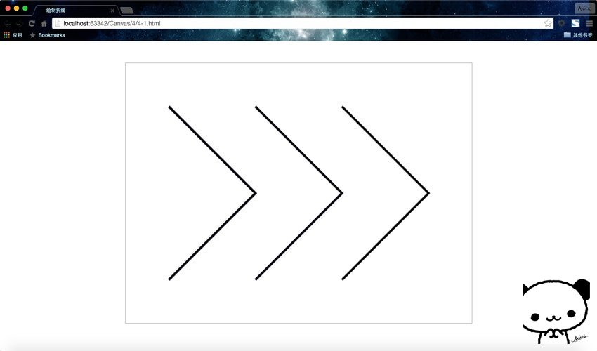

## 绘制多条折线

那同理，我们要绘制多条样式各不相同的折线怎么办呢？比如我们在这里画三条折线，分别是红色、蓝色、黑色。聪明的小伙伴肯定想到了，这还不简单，只需要平移一下再改下画笔颜色就行了。代码格式都一样的，复制就可以了。代码如下。

```HTML
<!DOCTYPE html>
<html lang="zh">
<head>
    <meta charset="UTF-8">
    <title>绘制折线</title>
</head>
<body>
<div id="canvas-warp">
    <canvas id="canvas" style="border: 1px solid #aaaaaa; display: block; margin: 50px auto;">
        你的浏览器居然不支持Canvas？！赶快换一个吧！！
    </canvas>
</div>

<script>
    window.onload = function(){
        var canvas = document.getElementById("canvas");
        canvas.width = 800;
        canvas.height = 600;
        var context = canvas.getContext("2d");

        context.moveTo(100,100);
        context.lineTo(300,300);
        context.lineTo(100,500);
        context.lineWidth = 5;
        context.strokeStyle = "red";
        context.stroke();

        context.moveTo(300,100);
        context.lineTo(500,300);
        context.lineTo(300,500);
        context.lineWidth = 5;
        context.strokeStyle = "blue";
        context.stroke();

        context.moveTo(500,100);
        context.lineTo(700,300);
        context.lineTo(500,500);
        context.lineWidth = 5;
        context.strokeStyle = "black";
        context.stroke();
    }
</script>
</body>
</html>
```

运行结果：




咦？是不是很奇怪？说好的先红色，再蓝色，再黑色呢？怎么全是黑色了？其实，这里的原因是我之前一直强调的一点——**Canvas是基于状态的绘制**。

什么意思呢？其实这段代码每次使用`stroke()`时，它都会把之前设置的状态再绘制一遍。第一次`stroke()`时，绘制一条红色的折线；第二次`stroke()`时，会再重新绘制之前的那条红色的折线，但是这个时候的画笔已经被更换成蓝色的了，所以画出的折线全是蓝色的。换言之，`strokeStyle`属性被覆盖了。同理，第三次绘制的时候，画笔颜色是最后的黑色，所以会重新绘制三条黑色的折线。所以，这里看到的三条折线，其实绘制了3次，一共绘制了6条折线。