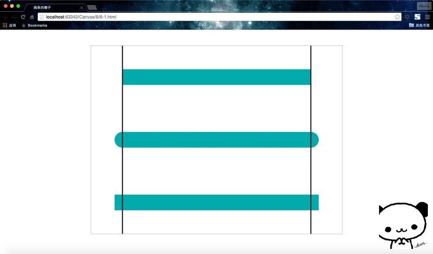
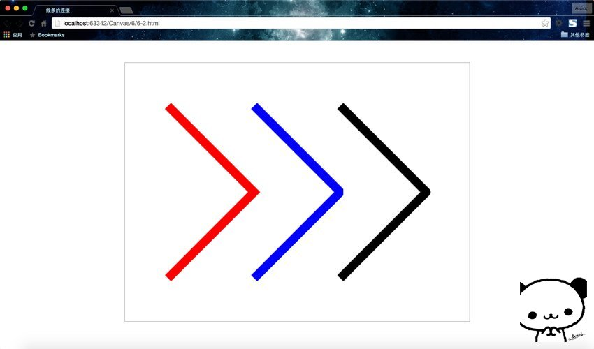

## 线条属性概述

线条的属性共有以下四个：

#### 1、lineCap属性

lineCap 定义上下文中线的端点，可以有以下 3 个值。

* butt：默认值，端点是垂直于线段边缘的平直边缘。
* round：端点是在线段边缘处以线宽为直径的半圆。
* square：端点是在选段边缘处以线宽为长、以一半线宽为宽的矩形。

#### 2、lineJoin属性

lineJoin 定义两条线相交产生的拐角，可将其称为连接。在连接处创建一个填充三角形，可以使用 lineJoin 设置它的基本属性。

* miter：默认值，在连接处边缘延长相接。miterLimit 是角长和线宽所允许的最大比例(默认是 10)。
* bevel：连接处是一个对角线斜角。
* round：连接处是一个圆。

#### 3、线宽

lineWidth 定义线的宽度(默认值为 1.0)。

#### 4、笔触样式

strokeStyle 定义线和形状边框的颜色和样式。

后面两个前面已经说过了，这里我们着重来看看前两个属性。

## 线条的帽子`lineCap`

废话不多说，直接上代码看效果。

```HTML
<!DOCTYPE html>
<html lang="zh">
<head>
    <meta charset="UTF-8">
    <title>线条的帽子</title>
</head>
<body>
<div id="canvas-warp">
    <canvas id="canvas" style="border: 1px solid #aaaaaa; display: block; margin: 50px auto;">
        你的浏览器居然不支持Canvas？！赶快换一个吧！！
    </canvas>
</div>

<script>
    window.onload = function(){
        var canvas = document.getElementById("canvas");
        canvas.width = 800;
        canvas.height = 600;
        var context = canvas.getContext("2d");

        context.lineWidth = 50;
        context.strokeStyle = "#1BAAAA";

        context.beginPath();
        context.moveTo(100,100);
        context.lineTo(700,100);
        context.lineCap = "butt";
        context.stroke();

        context.beginPath();
        context.moveTo(100,300);
        context.lineTo(700,300);
        context.lineCap = "round";
        context.stroke();

        context.beginPath();
        context.moveTo(100,500);
        context.lineTo(700,500);
        context.lineCap = "square";
        context.stroke();

        //下面画两个基准线方便观察
        context.lineWidth = 3;
        context.strokeStyle = "black";

        context.beginPath();
        context.moveTo(100,0);
        context.lineTo(100,600);
        context.moveTo(700,0);
        context.lineTo(700,600);
        context.stroke();
    }
</script>
</body>
</html>
```
运行结果：




这里我还做了两条平行线做一下参考，这样一眼就能看清lineCap三个值的特点。但要注意，这个帽子只在线条的端点处起作用，哪怕是折点很多的折线，也仅仅是在开始和终止的两个端点带帽子。如果想改变线条折点(两个线段的连接处)的样式，那就要用到下面的lineJoin属性。

## 线条的连接`lineJoin`

废话不多说，直接上代码看效果。这段代码改自4-3，只是设置了一下连接的属性。

```HTML
<!DOCTYPE html>
<html lang="zh">
<head>
    <meta charset="UTF-8">
    <title>线条的连接</title>
</head>
<body>
<div id="canvas-warp">
    <canvas id="canvas" style="border: 1px solid #aaaaaa; display: block; margin: 50px auto;">
        你的浏览器居然不支持Canvas？！赶快换一个吧！！
    </canvas>
</div>

<script>
    window.onload = function(){
        var canvas = document.getElementById("canvas");
        canvas.width = 800;
        canvas.height = 600;
        var context = canvas.getContext("2d");

        context.beginPath();
        context.moveTo(100,100);
        context.lineTo(300,300);
        context.lineTo(100,500);
        context.lineJoin = "miter";
        context.lineWidth = 20;
        context.strokeStyle = "red";
        context.stroke();

        context.beginPath();
        context.moveTo(300,100);
        context.lineTo(500,300);
        context.lineTo(300,500);
        context.lineJoin = "bevel";
        context.lineWidth = 20;
        context.strokeStyle = "blue";
        context.stroke();

        context.beginPath();
        context.moveTo(500,100);
        context.lineTo(700,300);
        context.lineTo(500,500);
        context.lineJoin = "round";
        context.lineWidth = 20;
        context.strokeStyle = "black";
        context.stroke();
    }
</script>
</body>
</html>
```

运行结果：


