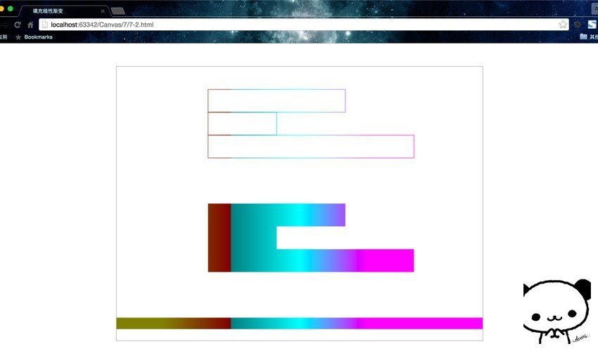

## 填充渐变形状

在画布上创建渐变填充有两个基本选项：**线性或径向**。线性渐变创建一个水平、垂直或者对角线的填充图案。径向渐变自中心点创建一个放射状填充。**填充渐变形状分为三步：添加渐变线，为渐变线添加关键色，应用渐变**。下面是它们的一些示例。

### 线性渐变

三步走战略：

1. 添加渐变线：
```JavaScript
var grd = context.createLinearGradient(xstart,ystart,xend,yend);
```

2. 为渐变线添加关键色(类似于颜色断点)：
```JavaScript
grd.addColorStop(stop,color);
```
这里的stop传递的是 0 ~ 1 的浮点数，代表断点到(xstart,ystart)的距离占整个渐变色长度是比例。

3. 应用渐变：
```JavaScript
context.fillStyle = grd;
context.strokeStyle = grd;
```


写个代码来看看。
```HTML
<!DOCTYPE html>
<html lang="zh">
<head>
    <meta charset="UTF-8">
    <title>填充线性渐变</title>
</head>
<body>
<div id="canvas-warp">
    <canvas id="canvas" style="border: 1px solid #aaaaaa; display: block; margin: 50px auto;">
        你的浏览器居然不支持Canvas？！赶快换一个吧！！
    </canvas>
</div>

<script>
    window.onload = function(){
        var canvas = document.getElementById("canvas");
        canvas.width = 800;
        canvas.height = 600;
        var context = canvas.getContext("2d");

        context.rect(200,100,400,400);

        //添加渐变线
        var grd = context.createLinearGradient(200,300,600,300);

        //添加颜色断点
        grd.addColorStop(0,"black");
        grd.addColorStop(0.5,"white");
        grd.addColorStop(1,"black");

        //应用渐变
        context.fillStyle = grd;

        context.fill();

    }
</script>
</body>
</html>
```

运行结果：


#### 绘制矩形的快捷方法

`fillRect(x,y,width,height)`、`strokeRect(x,y,width,height)`。这两个函数可以分别看做`rect()`与`fill()`以及`rect()`与`stroke()`的组合。因为`rect()`仅仅只是规划路径而已，而这两个方法确实实实在在的绘制。

```HTML
<!DOCTYPE html>
<html lang="zh">
<head>
    <meta charset="UTF-8">
    <title>填充线性渐变</title>
</head>
<body>
<div id="canvas-warp">
    <canvas id="canvas" style="border: 1px solid #aaaaaa; display: block; margin: 50px auto;">
        你的浏览器居然不支持Canvas？！赶快换一个吧！！
    </canvas>
</div>

<script>
    window.onload = function(){
        var canvas = document.getElementById("canvas");
        canvas.width = 800;
        canvas.height = 600;
        var context = canvas.getContext("2d");

        //添加渐变线
        var grd = context.createLinearGradient(100,300,700,300);

        //添加颜色断点
        grd.addColorStop(0,"olive");
        grd.addColorStop(0.25,"maroon");
        grd.addColorStop(0.5,"aqua");
        grd.addColorStop(0.75,"fuchsia");
        grd.addColorStop(0.25,"teal");

        //应用渐变
        context.fillStyle = grd;
        context.strokeStyle = grd;

        context.strokeRect(200,50,300,50);
        context.strokeRect(200,100,150,50);
        context.strokeRect(200,150,450,50);

        context.fillRect(200,300,300,50);
        context.fillRect(200,350,150,50);
        context.fillRect(200,400,450,50);

        context.fillRect(0,550,800,25);

    }
</script>
</body>
</html>
```

运行结果：



这两个页面都是水平渐变，但是要清楚线性渐变不一定是水平的，方向可以是任意的，通过渐变线的端点来设置方向。

### 径向渐变

同样是三步走战略，只不过是第一步的所用方法变了。

1. 添加渐变圆：
```JavaScript
var grd = context.createRadialGradient(x0,y0,r0,x1,y1,r1);
```

2. 为渐变线添加关键色(类似于颜色断点)：
```JavaScript
grd.addColorStop(stop,color);
```

3. 应用渐变：
```JavaScript
context.fillStyle = grd;
context.strokeStyle = grd;
```

**线性渐变是基于两个端点定义的，但是径向渐变是基于两个圆定义的。**

我们把示例7-2改写一下。

```HTML
<!DOCTYPE html>
<html lang="zh">
<head>
    <meta charset="UTF-8">
    <title>填充径向渐变</title>
</head>
<body>
<div id="canvas-warp">
    <canvas id="canvas" style="border: 1px solid #aaaaaa; display: block; margin: 50px auto;">
        你的浏览器居然不支持Canvas？！赶快换一个吧！！
    </canvas>
</div>

<script>
    window.onload = function(){
        var canvas = document.getElementById("canvas");
        canvas.width = 800;
        canvas.height = 600;
        var context = canvas.getContext("2d");

        //添加渐变线
        var grd = context.createRadialGradient(400,300,100,400,300,200);

        //添加颜色断点
        grd.addColorStop(0,"olive");
        grd.addColorStop(0.25,"maroon");
        grd.addColorStop(0.5,"aqua");
        grd.addColorStop(0.75,"fuchsia");
        grd.addColorStop(1,"teal");

        //应用渐变
        context.fillStyle = grd;

        context.fillRect(100,100,600,400);


    }
</script>
</body>
</html>
```

运行结果：

