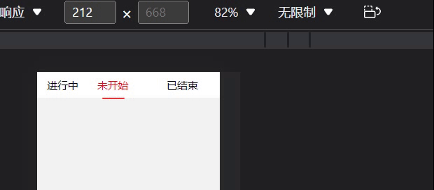

### 均分

用flex布局实现列的均等分是比较常见的作法，但是当我实际上使用这个的时候，在某些情况下样式会有些异常。所以打算认真去研究下flex布局。

均匀分配肯定首想的是使用flex: 1 去实现， 在一般情况下，确实是完美的符合需求。但是在某些子项的元素宽度超出了其他子项的时候，其他的子项会被压缩，出现宽度不均匀的情况。如下：



首先我们要知道flex: 1 其实是三个flex属性的缩写，分别是

```CSS
flex-grow: 1;
flex-shrink: 1;
flex-basis: 0%;
```

如果未显性设置flex时

```CSS

flex-grow: 0;
flex-shrink: 1;
flex-basis: 0;

```

当flex-basis为0时，会将flex布局的**max-content**覆盖，由于flex-grow的存在，flex元素可以任意增长。所以flex-shrink也不再生效。
也即flex: 1相当于flex-grow: 1,看看MDN对它的解释：

CSS属性 flex-grow设置了一个flex项主尺寸的flex增长系数。它指定了flex容器中剩余空间的多少应该分配给项目（flex增长系数）。

重点——**剩余空间**，这是指定怎么分配剩余空间的，不是先分配好空间

所以为了达到真正的均分列，只显性的设置**flex: 1**还不行，还需要设置**min-width: 0**