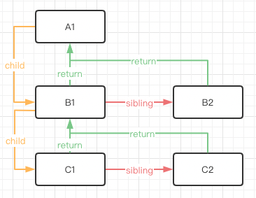

Web 界面由 DOM 树来构成，当其中某一部分发生变化时，其实就是对应的某个 DOM 节点发生了变化。在 React 中，构建 UI 界面的思路是由当前状态决定界面。前后两个状态就对应两套界面，然后由 React 来比较两个界面的区别，这就需要对 DOM 树进行 Diff 算法分析。

即给定任意两棵树，找到最少的转换步骤。但是标准的的 Diff 算法复杂度需要 O(n^3)，这显然无法满足性能要求。要达到每次界面都可以整体刷新界面的目的，势必需要对算法进行优化。这看上去非常有难度，然而 Facebook 工程师却做到了，他们结合 Web 界面的特点做出了两个简单的假设，使得 Diff 算法复杂度直接降低到 O(n)

“新内容”即被比较的新内容，它可能是三种类型：

- 对象： React 元素
- 字符串或数字： 文本
- 数组：数组元素可能是 React 元素或文本

### fiber是什么？

- 从运行机制上来解释，fiber是一种流程让出机制，它能让react中的同步渲染进行中断，并将渲染的控制权让回浏览器，从而达到不阻塞浏览器渲染的目的。
- 从数据角度来解释，fiber能细化成一种数据结构，或者一个执行单元。

```javascript

const fiber = {
stateNode,// dom节点实例
child,// 当前节点所关联的子节点
sibling,// 当前节点所关联的兄弟节点
return// 当前节点所关联的父节点
}

```



这样设计的好处就是在数据层已经在不同节点的关系给描述了出来，即便某一次任务被终止，当下次恢复任务时，这种结构也利于react恢复任务现场，知道自己接下来应该处理哪些节点。

当然，上面也抽象只是解释fiber是个什么东西，结合react的角度，综合来讲react中的fiber其实具备如下几点核心特点：

支持增量渲染，fiber将react中的渲染任务拆分到每一帧。（不是一口气全部渲染完，走走停停，有时间就继续渲染，没时间就先暂停）
支持暂停，终止以及恢复之前的渲染任务。（没渲染时间了就将控制权让回浏览器）
通过fiber赋予了不同任务的优先级。（让优先级高的运行，比如事件交互响应，页面渲染等，像网络请求之类的往后排）
支持并发处理（结合第3点理解，面对可变的一堆任务，react始终处理最高优先级，灵活调整处理顺序，保证重要的任务都会在允许的最快时间内响应，而不是死脑筋按顺序来）
到这里，我相信大家脑中应该有了一个模糊的理解了，可能有同学就好奇了，那这个fiber是怎么做到让出控制权的呢？react又是怎么知道接下来自己可以执行的呢？那接下里，我们就不得不介绍另一个API requestIdleCallback