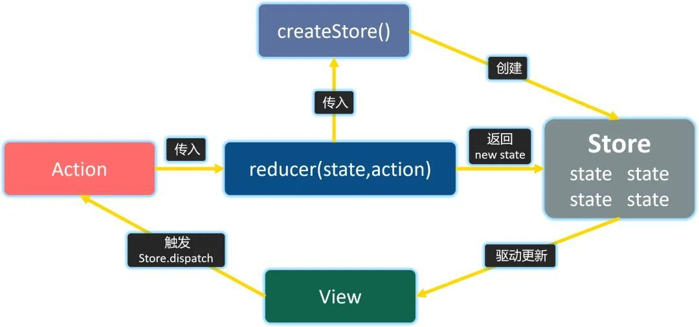

Redux强调三大基本原则：

在 Redux 的整个工作过程中，数据流是严格单向的。

对于一个 React 应用来说，视图（View）层面的所有数据（state）都来自 store。如果你想对数据进行修改，只有一种途径：派发 action，action 会被 reducer 读取，进而根据 action 内容的不同对数据进行修改、生成新的 state（状态），这个新的 state 会更新到 store 对象里，进而驱动视图层面做出对应的改变。



- 唯一数据源 (store)
- 保持状态只读 
- 数据改变只能通过纯函数完成( reducer必须要是一个纯函数，每个reducer函数格式如下：reducer(state, action))  


- action
  
Action 本质上是 JavaScript 普通对象。我们约定，action 内必须使用一个字符串类型的 type 字段来表示将要执行的动作
  ```javascript
  function addTodo(text) {
    return {
        type: ADD_TODO,
        text
    }
  }
  ```
- store
根据已有的 reducer 来创建 store 是非常容易的

- reducer
  ```javascript
  import { VisibilityFilters } from './actions'
  
  const initialState = {
    visibilityFilter: VisibilityFilters.SHOW_ALL,
    todos: []
  };

  function todoApp(state, action) {
    if (typeof state === 'undefined') {
        return initialState
    }
    // 这里暂不处理任何 action，
    // 仅返回传入的 state。
    return state
  }
  ```

### Mobx

这里以 Mobx 5 版本为例，实际上它是利用了 ES6 的 proxy 来追踪属性（旧版本是用 Object.defineProperty 来实现的）通过隐式订阅，自动追踪被监听的对象变化，进行数据的更新。


- Observable。它的 state 是可被观察的，无论是基本数据类型还是引用数据类型，都可以使用 MobX 的 (@)observable 来转变为 observable value。
  
- Reactions。它包含不同的概念，基于被观察数据的更新导致某个计算值（computed values），或者是发送网络请求以及更新视图等，都属于响应的范畴，这也是响应式编程（Reactive Programming）在 JavaScript 中的一个应用。
  
- Actions。它相当于所有响应的源头，例如用户在视图上的操作，或是某个网络请求的响应导致的被观察数据的变更。