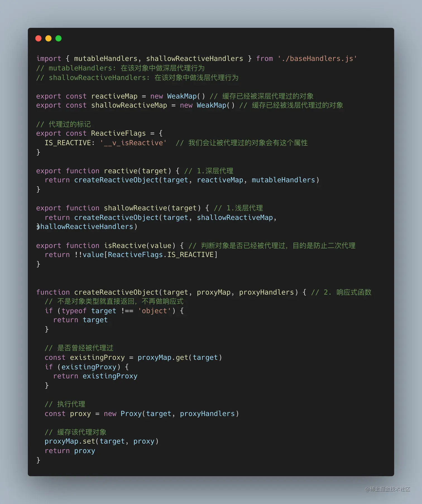

# 源码解读

https://hkc452.github.io/slamdunk-the-vue3/main/vue/reactivity/ref.html

# 基础
1. vue3新增了一种组合式api，之前vue2的是选项式写法。组合写法可以不用写data(), method(),computed:这种比较麻烦的写法。具体：
```javascript
<script setup lang="ts"> 
import { reactive } from 'vue'

const state = reactive({ count: 0 })
function increment() {
  state.count++
}
</script>
<template>
  <button @click="increment">
    {{ state.count }}
  </button>
</template>
```

参考：https://juejin.cn/post/7265999062243213372?searchId=2025021118524801EDEBDA663DEA88A7DA#heading-0

## 2.  响应式基础

### reactive

我们可以使用 reactive() 函数创建一个响应式对象或数组
```javascript
import { reactive } from 'vue'

const state = reactive({ count: 0 })

```

原理：
reactive() 返回的是一个原始对象的 Proxy，它和**原始对象是不相等的。只有代理对象是响应式**的，更改原始对象不会触发更新。因此，使用 Vue 的响应式系统的**最佳实践**是 仅使用你声明对象的代理版本


reactive() 的局限性:

1. 仅对对象类型有效（对象、数组和 Map、Set 这样的集合类型），而对 string、number 和 boolean 这样的 原始类型 无效
2. 因为 Vue 的响应式系统是通过属性访问进行追踪的，因此我们必须始终保持对该响应式对象的相同引用。这意味着我们不可以随意地“替换”一个响应式对象，因为这将导致对初始引用的响应性连接丢失：

```javascript
const state = reactive({ count: 0 })

// n 是一个局部变量，同 state.count
// 失去响应性连接
let n = state.count
// 不影响原始的 state
n++

// count 也和 state.count 失去了响应性连接
let { count } = state
// 不会影响原始的 state
count++

// 该函数接收一个普通数字，并且
// 将无法跟踪 state.count 的变化
callSomeFunction(state.count)

```


#### 源码解析


1. 从定义reactice函数源码开始




- 如果传入的参数target不是对象的话，会直接返回，说明了reactive只接受对象。
- 使用weakmap存储原对象和代理对象。会判断对象是否层代理过，是的话也会直接返回
- 使用proxy 代理原对象
- proxy对对象的代理函数，写在了同级目录下的 baseHandlers.js中


2. 代理对象的函数 -- baseHandlers


减轻我们的阅读负担，我们只看getter,setter,has, deleteProperty这几种, 实际上有十几种

- getter会判断target[key]是否还为对象，是的话会继续使用reactive递归处理。
- getter函数 会执行 effect模块中的track函数
- setter函数 会执行 effect模块中的trigger函数


3. effect 副作用函数


- 对象的被访问后， 执行track函数。track函数会创建一个数据结构, deps集合存储的是target对应key中的副作用函数（有点抽象，其实一般就是vue的render函数）
```JS
targetMap = {
  target: {
    key: [fn1,fn2]
  }
}

```
- 在对象被修改后，会取出targetMap中对应key的dep，然后遍历触发一次。

- 这里一开始看的时候没搞懂activeEffect是哪来赋值来的， 其实是mount 函数会去赋值。和Vue2很像。

### ref

reactive() 的种种限制归根结底是因为 JavaScript 没有可以作用于所有值类型的 “引用” 机制。为此，Vue 提供了一个 ref() 方法来允许我们创建可以使用任何值类型的响应式。
ref() 将传入参数的值包装为一个带 .value 属性的 ref 对象：

```javascript
const count = ref(0)

console.log(count) // { value: 0 }
console.log(count.value) // 0

count.value++
console.log(count.value) // 1

```


实现原理： 

```javascript
export function ref(value?: unknown) {
  return createRef(value)
}
const convert = <T extends unknown>(val: T): T =>
  isObject(val) ? reactive(val) : val
// 创建ref对象，传入raw和是否是shallow
function createRef(rawValue: unknown, shallow: boolean) {
  // 如果之前时ref则直接返回
  if (isRef(rawValue)) {
    return rawValue
  }
  return new RefImpl(rawValue, shallow)
}

// Ref对象类
class RefImpl<T> {
  // 存放 reactive(raw) 后的proxy
  private _value: T
  // 存放 raw
  private _rawValue: T

  // 建立与effect的关系
  public dep?: Dep = undefined
  // 是否ref的标识
  public readonly __v_isRef = true

  // 构造，传入raw 和 shallow
  constructor(value: T, public readonly _shallow: boolean) {
    // 存储 raw 
    this._rawValue = _shallow ? value : toRaw(value)
    // 如果是不是shallow则 存储 reactive proxy 否则存储传入参数
    this._value = _shallow ? value : toReactive(value)
  }

  // getter value拦截器
  get value() {
    // track Ref 收集依赖
    trackRefValue(this)
    return this._value
  }

  // setter value拦截器
  set value(newVal) {
    // 如果是需要深度响应的则获取 入参的raw
    newVal = this._shallow ? newVal : toRaw(newVal)

    // 查看要设置值是否与当前值是否修改
    if (hasChanged(newVal, this._rawValue)) {
      // 存储新的 raw
      this._rawValue = newVal
      // 更新value 如果是深入创建的还需要转化为reactive代理
      this._value = this._shallow ? newVal : toReactive(newVal)
      // 触发value，更新关联的effect
      triggerRefValue(this, newVal)
    }
  }
}
```

当你明白了 reactive 的原理后，ref 源码看起来就简单多了，在这份代码中主要有以下功能

- ref 函数执行得到的结果是一个 RefImpl 对象
- ref 借助 reactive 来处理对象类型的数据
- 在 RefImpl 类中，原始类型借助面向对象的 getter 和 setter 函数来实现读取和修改 _val 的值
- 读取 ref 返回的数据时，通过 track 为属性添加副作用函数
- 修改 ref 返回的数据时，通过 trigger 执行掉该属性身上的副作用函数

### ref 和 reactived的区别 

reactive 使用 proxy 代理了对象的各种操作行为，在属性 读取值，判断 等行为中，为属性添加副作用函数，在属性被 修改值，删除等行为中，触发该属性身上绑定的副作用函数来实现响应式效果
ref 中，当参数是对象时，借助reactive 代理来实现响应式，当参数是原始值时，给值添加 value 函数并采用原生的 getter和setter方式，实现为属性添加副作用函数和触发副作用函数的能力，进而达到响应式的效果

## 3. 计算属性

###  3.1
接受一个函数，函数的返回值是计算值的结果。

<script setup>
import { reactive, computed } from 'vue'

const author = reactive({
  name: 'John Doe',
  books: [
    'Vue 2 - Advanced Guide',
    'Vue 3 - Basic Guide',
    'Vue 4 - The Mystery'
  ]
})

// 一个计算属性 ref
const publishedBooksMessage = computed(() => {
  return author.books.length > 0 ? 'Yes' : 'No'
})
</script>

<template>
  <p>Has published books:</p>
  <span>{{ publishedBooksMessage }}</span>
</template>


### 3.2 最佳实践​
## Getter 不应有副作用​
计算属性的 getter 应只做计算而没有任何其他的副作用，这一点非常重要，请务必牢记。举例来说，不要在 getter 中做**异步请求或者更改 DOM**！一个计算属性的声明中描述的是如何根据其他值派生一个值。因此 getter 的职责应该仅为计算和返回该值。在之后的指引中我们会讨论如何使用监听器根据其他响应式状态的变更来创建副作用。

## 避免直接修改计算属性值​
从计算属性返回的值是派生状态。可以把它看作是一个“临时快照”，每当源状态发生变化时，就会创建一个新的快照。更改快照是没有意义的，因此计算属性的返回值应该被视为只读的，并且永远不应该被更改——应该更新它所依赖的源状态以触发新的计算。

## 4.深入组件

- 注册

- props

defineProps

使用一个对象绑定多个 prop​
如果你想要将一个对象的所有属性都当作 props 传入，你可以使用没有参数的 v-bind，即只使用 v-bind 而非 :prop-name。(Vue2同理) 例如，这里有一个 post 对象：

```javascript
const post = {
  id: 1,
  title: 'My Journey with Vue'
}
```

以及下面的模板：

```javascript
<BlogPost v-bind="post" />
```

而这实际上等价于：

```javascript
<BlogPost :id="post.id" :title="post.title" />
```

### 单向数据流
另外，每次父组件更新后，所有的子组件中的 props 都会被更新到最新值，这意味着你不应该在子组件中去更改一个 prop。

导致你想要更改一个 prop 的需求通常来源于以下两种场景：

一： prop 被用于传入初始值；而子组件想在之后将其作为一个局部数据属性。在这种情况下，最好是新定义一个局部数据属性，从 props 上获取初始值即可：

```javascript
const props = defineProps(['initialCounter'])

// 计数器只是将 props.initialCounter 作为初始值
// 像下面这样做就使 prop 和后续更新无关了
const counter = ref(props.initialCounter)
```

二： 需要对传入的 prop 值做进一步的转换。在这种情况中，最好是基于该 prop 值定义一个计算属性：

```javascript
const props = defineProps(['size'])

// 该 prop 变更时计算属性也会自动更新
const normalizedSize = computed(() => props.size.trim().toLowerCase())
```


## 5. 事件

### 1. 触发与监听事件


### 2. 声明触发的事件

defineEmits()

组件可以显式地通过 defineEmits() 宏来声明它要触发的事件：

```javascript
<script setup>
defineEmits(['inFocus', 'submit'])
</script>
```

我们在 <template> 中使用的 $emit 方法不能在组件的 <script setup> 部分中使用，但 defineEmits() 会返回一个相同作用的函数供我们使用：


### watch与watchEffect

与Vue2类似，都是监听某个值的变化，然后做对于的操作。不同的是watchEffect不用指定监听的key, 函数用到哪些属性就会自动监听，有点类似于computed。

用法
```javascript
watchEffect(()=>{
  const x1 = sum.value
  const x2 = person.value
  console.log('sum 或者 peson发生改变')
})
```

