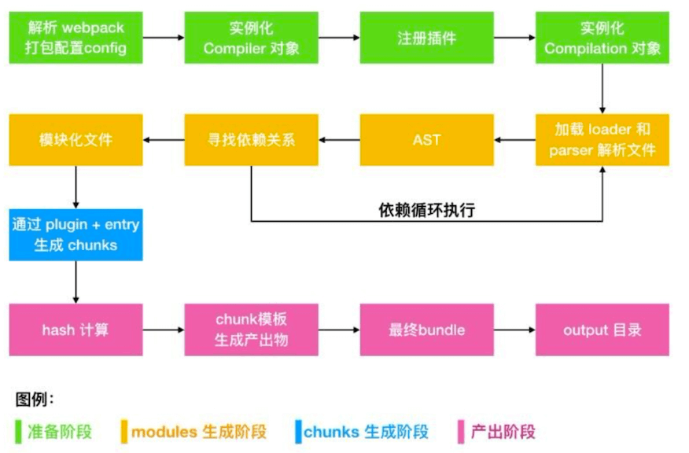

## Compiler 

Compiler 继承自 Tapable，是 Webpack 的整个生命周期管理，代表了完整的 Webpack 环境配置。
每个Webpack 的配置，对应一个 Compiler 对象，记录了 Webpack 的 options 、loader 和 plugin 等信息，并且通过的 Hook 机制管理整个打包流程的生命周期。

### 钩子

Compiler 继承自 Tapable，是 Webpack 的整个生命周期管理，代表了完整的 Webpack 环境配置。
每个Webpack 的配置，对应一个 Compiler 对象，**记录了 Webpack 的 options 、loader 和 plugin 等信息**，并且通过的 Hook 机制管理整个打包流程的生命周期。


## Compilation

Compilation 也继承自 Tapable，代表了一次资源版本构建，包含了当前的模块资源、编译生成资源、变化的文 件、以及被跟踪依赖的状态信息。**（具体到资源， 可以到构建资源信息）**

### 钩子

在 Compilation 中处理的对象分别是 module、chunk、asset，由 modules 组成 chunks，由 chunks 生成 assets，处理顺序是 module → modules → chunks → assets，先从单个 module 开始处理，查找依赖关系， 最后完成单个 module 处理，拼装好 modules 之后，开始 chunks 阶段处理，最后在根据优化配置，按需生成assets。

### 流程


主要分为三个阶段

- 准备阶段: 主要是创建compiler, compilation
- 编译阶段: 递归分析依赖，并生成相对应的chunks
- 生成资源: 根据 chunks 生成最终文件，主要有三个步骤：模板 Hash 更新，模板渲染 chunk，生成文件。

#### 准备阶段

初始化plugin, loader, entry， output等参数， 创建compiler, compilatino对象， 注册相应的生命周期函数。


#### 编译阶段

首先会调用compilation.addEntry方法， 将第一批modules进行解析。 而这就是entry的配置入口文件。

```JS
// lib/EntryPlugin
apply(compiler) {
		compiler.hooks.compilation.tap(
			"EntryPlugin",
			(compilation, { normalModuleFactory }) => {
				compilation.dependencyFactories.set(
					EntryDependency,
					normalModuleFactory
				);
			}
		);

		const { entry, options, context } = this;
		const dep = EntryPlugin.createDependency(entry, options);

		compiler.hooks.make.tapAsync("EntryPlugin", (compilation, callback) => {
			compilation.addEntry(context, dep, options, err => {
				callback(err);
			});
		});
	}

```

addEntry方法实际上是调用了_addEntryItem， 方法如下： 

```JS

_addEntryItem(context, entry, target, options, callback) {
    
    this.addModuleTree(
                {
                    context,
                    dependency: entry,
                    contextInfo: entryData.options.layer
                        ? { issuerLayer: entryData.options.layer }
                        : undefined
                },
                (err, module) => {
                    if (err) {
                        this.hooks.failedEntry.call(entry, options, err);
                        return callback(err);
                    }
                    this.hooks.succeedEntry.call(entry, options, module);
                    return callback(null, module);
                }
            );

}

```


chunk 的生成算法如下：

Webpack 先将 entry 中对应的 module 都生成一个新的 chunk；

遍历 module 的依赖列表，将依赖的 module 也加入到 chunk 中；

如果一个依赖module是动态引入(import()、require.ensure())的模块，那么就会根据这个module创建一个新的 chunk，继续遍历依赖;

重复上面的过程，直至得到所有的 chunks。


## 产出阶段

在产出阶段，webpack 会根据 chunks 生成最终文件。主要有三个步骤：模板 hash 更新，模板渲染 chunk，生成 bunlde 文件。

Compilation 在实例化的时候，就会同时实例化三个对象：mainTemplate，chunkTemplate ，moduleTemplate ， 这三个对象是用来渲染 chunk 对象，得到最终代码的模板。


## 总结

这一节我们主要分析了 webpack 的构建流程，我们在来回顾一波 webpack 的流程：

初始化参数：包括从配置文件和 shell 中读取和合并参数，然后得出最终参数。

使用上一步得到的参数实例化一个 Compiler 类，注册所有的插件，给对应的 Webpack 构建生命周期绑定Hook。

开始编译：执行 Compiler 类的 run 方法开始执行编译。

compiler.run 方法调用 compiler.compile，在 compile 内实例化一个 Compilation 类，Compilation 是做构建打包的事情，主要事情如下：

查找入口：根据 entry 配置，找出全部的入口文件
编译模块：根据文件类型和 loader 配置，使用对应 loader 对文件进行转换处理
解析文件的 AST 语法树
找出文件依赖关系（arcon）
递归编译依赖的模块
递归完后得到每个文件的最终结果，根据 entry 配置生成代码块 chunk

输出所有 chunk 到对应的 output 路径，打包完成。




### 参考
https://github.com/darrell0904/webpack-doc/blob/master/docs/chapter4/webpack_process.md