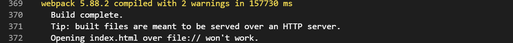

## 背景

做这个升级的主要原因有以下几点：

### 1.开发体验和效率

打包流水线构建速度很慢，经常一次要半个小时。非常影响测试，交付效率

### 2.rspack的兴起

看到了最近很火的rspack的文章，和接触到了webpack5的一些新特性，为了尝试新的工具，不管最后是否能使用rspack，都去做了些小尝试，对打包工具做个升级优化。


## 升级事项

- [ ] 依赖升级 https://www.webpackjs.com/migrate/5/#upgrade-webpack-and-its-plugins-loaders
      
     - [x] 升级webpack配置文件用到的loader和plugin至最新版
     - [x]  node-sass(4.14.0) sass-loader(7.3.1) （rspack也可用）
     - [x] webpack配置移除node
     - [x] webpack-dev-server升级至4.15.1， 并改写启动命令为webpack serve
     - [x] webpack-merge升级至^5.0.0
     - [x] dev的devtool值变为 'eval-cheap-module-source-map' ,prod变为source-map
     - [x] devser配置项
     - [x] optimization 配置项
     - [x] htmlwebpack plugin 升级至v5.0, 配置项变动!!#ff0000  chunksSortMode: 'dependency'!!
     - [x] path-broswerfy, webpack5不再默认支持
     - [x] 移除uglify-jsw-webapack ,用terserplugin代替(prod)
     - [x] 移除fridenly-error 改用@soda/fridenly-plugin 并改写utils callback
     - [x] eslint-loader(被废弃)改为ESLintWebpackPlugin（验证是否正确引用配置文件）
     - [x] styllint-webpack-plugin 升级(验证是否正确引用配置文件)
     - [x] copy-webpack-plugin升级至^11.0.0
     - [x] webpack-bundle-analyzar 升级至^4.0.0
     - [x] hard-source-webpack-plugn移除
     - [x] file-loader、url-loader、raw-loader依赖移除，webpack 5内置
     - [x] eslint 依赖升级至^7.0.0，相应的配置文件变动.eslintrc
     - [x] mini-css-extract-plugin升级
     - [x] babel 升级v7，相应的配置文件变动，.babelrc
     - [x] optimize-css-plugin 变更为 css-minimizer-webpack-plugin
     - [x] copywebpackplugn 升级，配置项变动
     - [x] postcss-loader,import,url 升级，移除autoprefix变为post-preset-env
## Breaking change:
- [x] webpack配置文件 参考 vue/cli 重点是(loader, plugin处理)
- [ ] ~~移除dllplugin 改为提取第三方库~~
- [ ]~~集成单元测试框架~~


## 项目问题优化

升级的话主要是对一些第三方库依赖和webpack配置进行了升级改动，在升级的过程中，也发现了一些问题，顺带优化掉了。例如：


- ### output产物hash
  
经常有用户或者测试反馈，为什么更新了没有生效，或者加载不出页面。其实这都是因为浏览器的缓存导致的。webpack的output之前一直用的都是`[name]`或者`[chunkhash]`

```JS
output: {
    filename: utils.assetsPath('js/[name].js'),
    chunkFilename: utils.assetsPath('js/[name].[chunkhash].js')
}
```

改成`contenthash`并且在路由加上异常捕获处理，友好的提示用户进行页面刷新。有效的解决了问题，反馈的人少了很多。


```javascript

router.onError((error) => {
    const errorReg = /Loading( CSS)? chunk (\d)+ failed/g
    const isChunkError = error.message.match(errorReg)
    console.log(error.message, isChunkError)
    if (isChunkError) {
        window.$bkNotify({
            title: '系统提示',
            theme: 'primary',
            delay: 0,
            limit: 1,
            type: 'notify',
            message: '发现新版本，请刷新页面',
            position: 'bottom-right'
        })
    }
})

```

- #### 组件库重复打包
  
对基础组件库的打包我们是在webpack配置了单独生成一个chunk的，所以我们配置的对`node_modules`打包生产`vendors` js文件应该是不包含在内的，但是使用模块分析工具的时候发现也在里面，排查发现是引入了基础组件库的b按需引入样式文件babel,plugin引起的，所以我们就把这个plugin移除了。 反正大部分组件我们都需要用到。


- #### dll 打包阶段

由于每次跑build都会对dll进行打包，但是其实dll的依赖在绝大多数情况下都不会发生变化，所以我们可以把这个文件缓存下来，只在每次改变的时候时候重新跑一次dll就可以了。 

先把dll的文件放置在服务器，在index.html写好dll的scripr标签以及文件路径。 加上我们的文件最后的产物是有contenthash的，每次都需要更新一下，所以为了打包的时候自动把dll产物的文件名字填充到index.html模板上，也是写了个plugin去完成。如下：

```JS
const path = require('path')
const fs = require('fs')

class InjectDLLVendorsPlugin {
    apply(compiler, callback) {
        compiler.hooks.emit.tapAsync('InjectDLLVendorsPlugin', (compilation, callback) => {
            const assets = Object.keys(compilation.assets)
            const filePath = path.join(__dirname, '../', 'index.prod.html')
            const assetsLen = assets.length
            const scriptTagArr = []
            for (let i = 0; i < assetsLen; i++) {
                scriptTagArr.push(`<script type=text/javascript src="./${assets[i]}"></script>`) ;
            }
            fs.readFile(filePath, 'utf-8', (err, data) => {
                if (err) {
                    console.error(err)
                    return
                }

                const scriptTag = scriptTagArr.join('\n')
                const updatedData = data.replace('</body>', scriptTag + '</body>')

                fs.writeFile(filePath, updatedData, (err) => {
                    if (err) {
                        console.error(err)
                        return
                    }
                    console.log('Script tag added successfully!');
                })
            })

            callback()
        })
    }
}

module.exports = InjectDLLVendorsPlugin

```


## Tips

- 安装了stylelint 要在vscode设置检测vue文件，不然不会检测。


## 效果

流水线使用`webpack4`打包的耗时


升级之后的耗时



可以看到时间是足足缩短了一般的，所以webpack5的优化还是很好的，其中webpack5较之前有什么改进的话话打算另开一篇文章来写，这里就不展开讲了。

## 参考
1. nvm
2. https://blog.csdn.net/qq_46043634/article/details/125700816 sass-loader nvm 安装 npm失败问题 
https://blog.csdn.net/qq_40095911/article/details/119253908  node-sass对应版本
3. [GitHub - babel/babel-loader: 📦 Babel loader for webpack](https://github.com/babel/babel-loader)