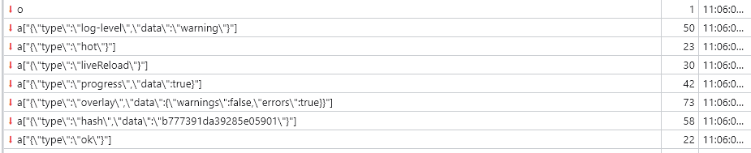
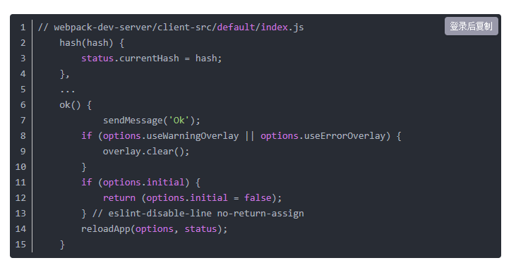
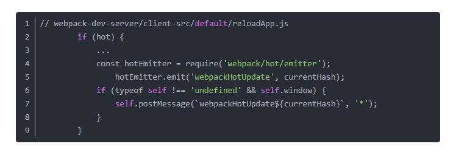
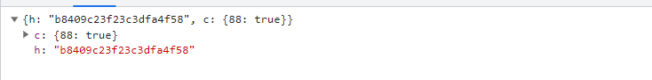
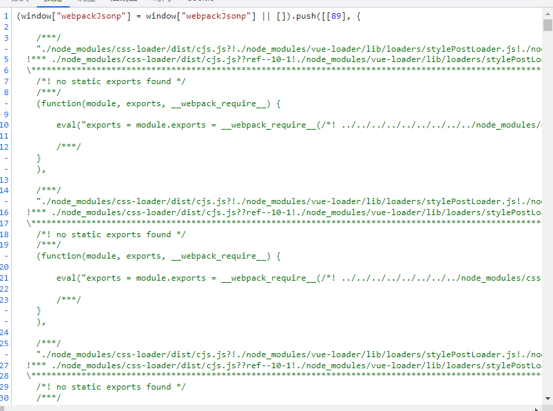

相关书籍： http://webpack.wuhaolin.cn/
### 基本原理
- 确定入口：根据配置中的entry找出所有的入口文件
- 编译模块：从入口文件出发，调用所有配置的Loader对模块进行翻译,再找出该模块依赖的模块，再递归本步骤直到所有入口依赖的文件都经过处理
- 完成编译模块：经过第四步之后，得到了每个模块被翻译之后的最终内容以及他们之间的依赖关系
- 输出资源：根据入口和模块之间的依赖关系，组装成一个个包含多个模块的chunk，再将每个chunk转换成一个单独的文件加入输出列表中，这是可以修改输出内容的最后机会


### 准备阶段

主要是创建 compiler 和 Compilation 对象

首先 webapck 会初始化参数，从配置文件和命令行中读取并合并参数，得到 webpack 最终的配置参数。（shell 中的参数的优先级高于配置文件）。

接着根据上面得到的配置参数，实例化一个 compiler 类，并且**注册**所有的插件，给对应的 webpack 构建**生命周期绑上相应的 hook**。

```javascript
options = new WebpackOptionsDefaulter().process(options);

compiler = new Compiler(options.context);
compiler.options = options;

// 绑定 NodeEnvironmentPlugin
new NodeEnvironmentPlugin({
  infrastructureLogging: options.infrastructureLogging
}).apply(compiler);

// 绑定配置文件中的 plugins
if (options.plugins && Array.isArray(options.plugins)) {
  for (const plugin of options.plugins) {
    if (typeof plugin === "function") {
      plugin.call(compiler, compiler);
    } else {
      plugin.apply(compiler);
    }
  }
}
// 触发 compiler 环境 的 hook
compiler.hooks.environment.call();
compiler.hooks.afterEnvironment.call();
// 注册 webpack 内置插件
compiler.options = new WebpackOptionsApply().process(options, compiler);

```

其中上面 WebpackOptionsApply 用于将所有的配置 options 参数转换成 webpack 内置插件：

比如：

output.library：使用 LibraryTemplatePlugin
externals：使用 ExternalsPlugin
devtool：使用 EvalDevtoolModulePlugin，SourceMapDevToolPlugin
Mode=prodution：使用 FlagIncludedChunksPlugin、TerserPlugin 等


###  webpack-merge
 配置分离

在每个环境的多个文件中维护配置，并通过--config参数将webpack指向每个文件，通过模块导入共享配置。

### webpack-dev-server

webpack-dev-server 为你提供了一个简单的 web 服务器，并且能够实时重新加载(live reloading)。让我们设置以下：

```javascript

devServer:{
    port: 3030,
    contentBase:// 默认情况下，将使用当前工作目录作为提供内容的目录，但是你可以修改为其他目录：
    compress:true  //开启gzip压缩
    open:true //
    proxy:{
         "/api": "http://localhost:3000", //请求到 /api/users 现在会被代理到请求 http://localhost:3000/api/users
         "/api": {  //如果你不想始终传递 /api ，则需要重写路径
            target: "http://localhost:3000",
            pathRewrite: {"^/api" : ""}
        }
    }
}

```

#### HMR基本原理

Webpack 生态下，只需要经过简单的配置即可启动 HMR 功能，大致上分两步：

配置 devServer.hot 属性为 true，如：

```javascript

// webpack.config.js
module.exports = {
  // ...
  devServer: {
    // 必须设置 devServer.hot = true，启动 HMR 功能
    hot: true
  }
};

```
之后，还需要调用 module.hot.accept 接口，声明如何将模块安全地替换为最新代码，如：

```javascript

import component from "./component";
let demoComponent = component();

document.body.appendChild(demoComponent);
// HMR interface
if (module.hot) {
  // Capture hot update
  module.hot.accept("./component", () => {
    const nextComponent = component();

    // Replace old content with the hot loaded one
    document.body.replaceChild(nextComponent, demoComponent);

    demoComponent = nextComponent;
  });
}

```

1. 启动阶段

- 代码文件通过 webpack Compile 进行打包
- 将打包好的文件传输给 Bundle Server（使用了内存文件系统，无实际的文件生成）
- 然后Bundle Server会让文件以服务器的方式让浏览器可以访问到
- 代码展示到浏览器

2. 更新阶段

- 变更后的代码同样会通过 webpack Compile 进行打包编译（依赖了webpack-dev-middleware来监听变化和获取文件）
  
在启动 devServer 的时候，sockjs 在服务端和浏览器端建立了一个 webSocket 长连接，以便将 webpack 编译和打包的各个阶段状态告知浏览器，最关键的步骤还是 webpack-dev-server 调用 webpack api 监听 compile的 done 事件，当compile 完成后，webpack-dev-server通过 _sendStatus 方法将编译打包后的新模块 hash 值发送到浏览器端。

- HMR Server即可知道哪些资源、js模块、文件发生了改变

这里的主要逻辑位于 webpack-dev-server/client-src 中，webpack-dev-server 修改了webpack 配置中的 entry 属性，在里面添加了 webpack-dev-client 的代码，这样在最后的 bundle.js 文件中就会有接收 websocket 消息的代码了。输出的 bundle.js 会包含接收 websocket 消息的代码。而且 plugin 也会注入一个 HotModuleReplacementPlugin，构建过程中热加载相关的逻辑都在这个插件中。

- 然后通过 websorket 传输.hot-update.json的形式，通知 HMR Runtime

前面提到会建立一个ws链接，然后监听webpack compile done 事件， 发送消息给客户端



可以看到，接收的消息只有 type 和 hash 两个内容。在 client 里面的逻辑，他们分别对应不同的处理逻辑：



可以看出，当接收到 type 为 hash 消息后会将 hash 值暂存起来，当接收到 type 为 ok 的消息后对应用执行 reload 操作，而 hash 消息是在 ok 消息之前的。再看看 reload 里面的处理逻辑：




可以看出，如果配置了模块热更新，就调用 webpack/hot/emitter 将最新 hash 值发送给 webpack，然后将控制权交给 webpack 客户端代码。如果没有配置模块热更新，就进行 liveReload 的逻辑。webpack/hot/dev-server 中会监听 webpack-dev-server/client-src 发送的 webpackHotUpdate 消息,然后调用 webpack/lib/HotModuleReplacement.runtime 中的 check 方法，检测是否有新的更新


在 check 过程中，主要调用了两个方法 hotDownloadManifest 和 hotDownloadUpdateChunk。hotDownloadManifest 是通过 Ajax 向服务器请求是否有更新的文件，如果有就返回对应的文件信息，hotDownloadUpdateChunk 是通过Jsonp的方式，请求最新的代码模块。如下图所示:






- HMR Runtime 在接收到文件变化后，就会更新代码
最终代码更新，且无需刷新浏览器

在其中最需要我们关心的，应该是 HMR Runtime 在接收到文件变化后，就会更新代码 这一步，在获取到了变更的文件后，到底是通过怎么样的方式对页面进行刷新的呢？


模块代码的替换逻辑可能非常复杂，幸运的是我们通常不太需要对此过多关注，因为业界许多 Webpack Loader 已经提供了针对不同资源的 HMR 功能，例如：

- style-loader 内置 Css 模块热更
- vue-loader 内置 Vue 模块热更
- react-hot-reload 内置 React 模块热更接口
因此，站在使用的角度，只需要针对不同资源配置对应支持 HMR 的 Loader 即可，很容易上手。