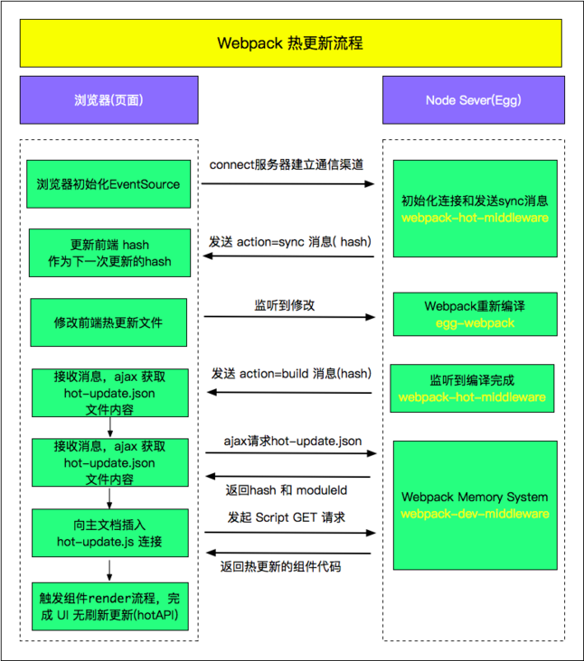

相关书籍： http://webpack.wuhaolin.cn/
### 基本原理
- 确定入口：根据配置中的entry找出所有的入口文件
- 编译模块：从入口文件出发，调用所有配置的Loader对模块进行翻译,再找出该模块依赖的模块，再递归本步骤直到所有入口依赖的文件都经过处理
- 完成编译模块：经过第四步之后，得到了每个模块被翻译之后的最终内容以及他们之间的依赖关系
- 输出资源：根据入口和模块之间的依赖关系，组装成一个个包含多个模块的chunk，再将每个chunk转换成一个单独的文件加入输出列表中，这是可以修改输出内容的最后机会

###  webpack-merge
 配置分离

在每个环境的多个文件中维护配置，并通过--config参数将webpack指向每个文件，通过模块导入共享配置。

### webpack-dev-server

webpack-dev-server 为你提供了一个简单的 web 服务器，并且能够实时重新加载(live reloading)。让我们设置以下：

```javascript

devServer:{
    port: 3030,
    contentBase:// 默认情况下，将使用当前工作目录作为提供内容的目录，但是你可以修改为其他目录：
    compress:true  //开启gzip压缩
    open:true //
    proxy:{
         "/api": "http://localhost:3000", //请求到 /api/users 现在会被代理到请求 http://localhost:3000/api/users
         "/api": {  //如果你不想始终传递 /api ，则需要重写路径
            target: "http://localhost:3000",
            pathRewrite: {"^/api" : ""}
        }
    }
}

```

#### 基本原理

- Webpack编译期，为需要热更新的 entry 注入热更新代码(EventSource通信)
- 页面首次打开后，服务端与客户端通过 EventSource 建立通信渠道，把下一次的 hash 返回前端
- 客户端获取到hash，这个hash将作为下一次请求服务端 hot-update.js 和 hot-update.json的hash
- 修改页面代码后，Webpack 监听到文件修改后，开始编译，编译完成后，发送 build 消息给客户端
- 客户端获取到hash，成功后客户端构造hot-update.js script链接，然后插入主文档
- hot-update.js 插入成功后，执行hotAPI 的 createRecord 和 reload方法，获取到 Vue 组件的 render方法，重新 render 组件， 继而实现 UI 无刷新更新。

