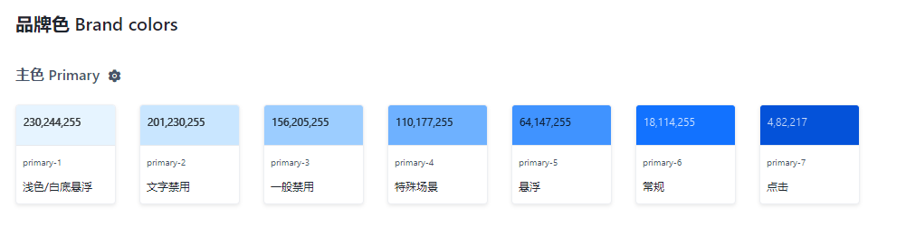
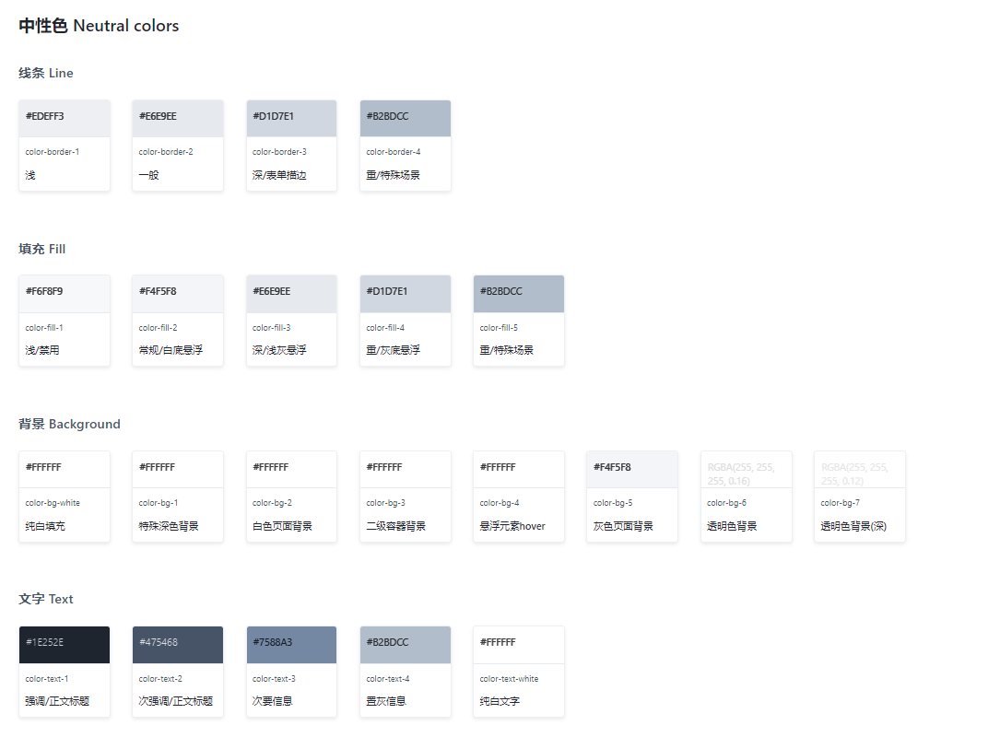
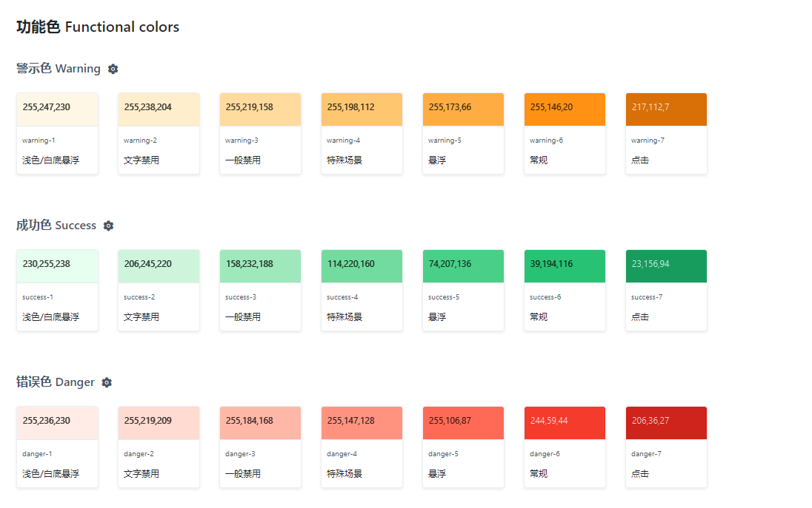
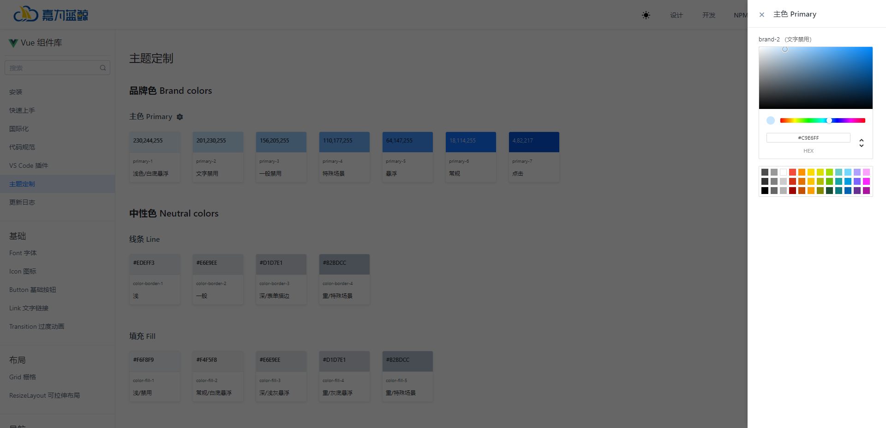
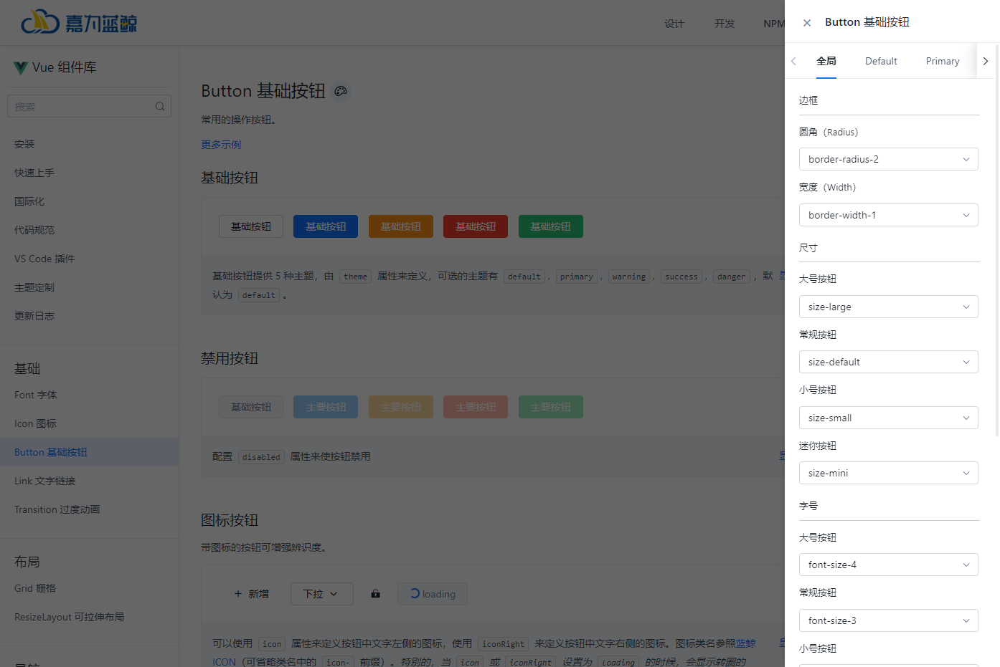
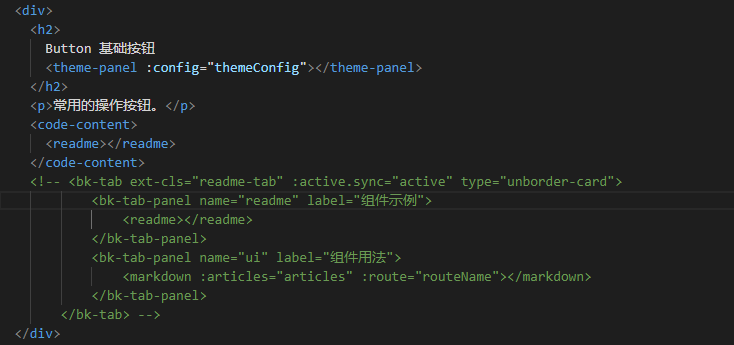
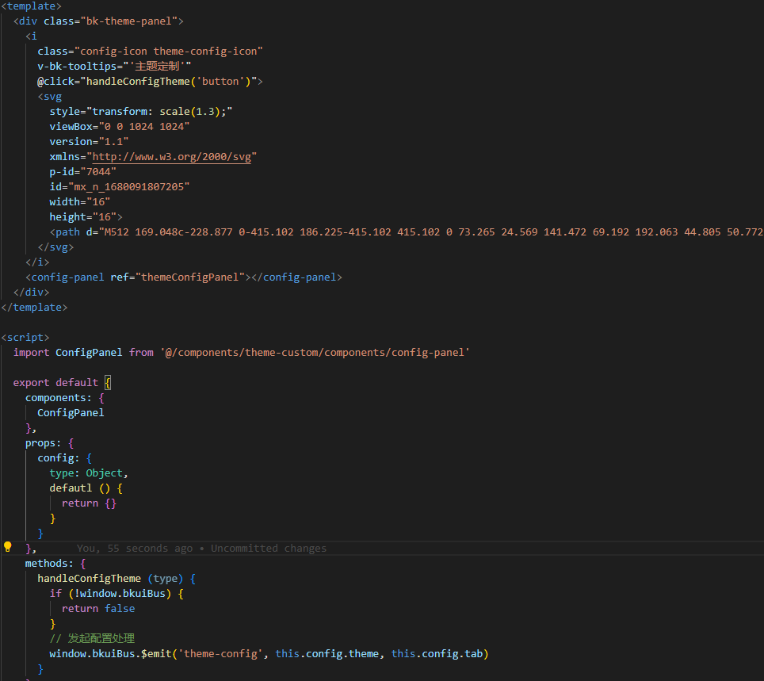
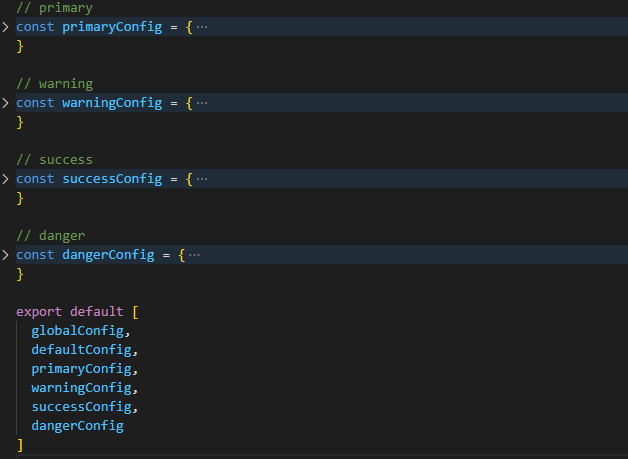
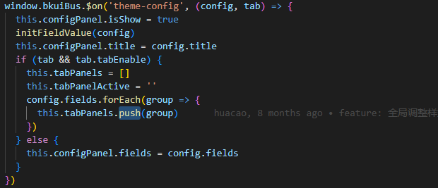

## 原理 
今天抽空写一下主题定制的原理，之前不是很明白，现在领悟的七七八八，备份一下，防止之后忘记。

一开始上来就做主题定制，可能思维还跟不上，因为要支持上千种颜色，那么我们从最简单的开始做起: 支持暗色和亮色。

### 暗色和亮色

1. 首先最开始想到的是用两套样式，然后js去加载对应主题的css文件。缺点就是我们需要写两份样式，而且当需要定制化的时候，这个办法就行不通了。

2. css不行，那我就用less, sass变量， 在写样式的时候，我们任何地方都是使用变量。这样的方案就是只用写一份样式，并且只需要定义好使用的变量在暗色和亮色的颜色各是什么就可以了。
缺点是我们知道less,sass是需要经过预编译的，所有变量都需要事先定义好，同样无法做到定制化。 （arco design可以， 具体原理是?）


### 主题定制

多亏了新出的css变量，让我们可以做带不用预先定义好变量的颜色，就可以使用了。 我们现在的组件库也是用这样的原理。
css变量是什么这里就不过多介绍了。其实和less,sass很像，使用方法上有点区别,我们在css文件写变量的名字和值，注意要用--开头

```CSS

// 定义
--primary-6: #1272ff;

// 使用

color: var(--primary-6);


```

这样在我们只需要加载不同的css变量文件，就可以做到主题定制。然后问题又来了，主题定制都是给设计人员或者第三方开放的，那么他在哪里去配置或者怎么配置能产生这样一份css
变量的文件呢？

### 功能化

首先我们会定义好基础色（品牌色），功能色，中性色，这三种颜色几乎就是我们在组件中使用的所有颜色。








其中基础色和功能色是根据一个**色阶函数**生成的，先定义好一个标准颜色，6号色，其他1-10号色都是自动生成的，这里生成色阶函数得出的结果是hex值，最好把他转成
rgb色值，这样我们在使用的时候就可以用透明度了。

然后还有一个需要注意的点是，暗色和亮色的色阶函数不一样的，需要根据不同情况调用。

然后中性色比较特殊，只分为两种，亮色系和暗色系。 所以只需要根据主题是属于暗色系和亮色系，去给一个默认值就好。


好那么问题来了，用户如何调整颜色呢？ 我们对上面的基础色，中性色，功能色，是用的一种 "color-picker"的面板去调整。这样方便用户随心所欲的去调整自己喜欢的颜色。



实现原理就是config-pannel这个组件会使用eventbus全局监听一个事件，当触发后会设置这个slider的show为true。
然后我们需要传入设置当前颜色变量的变量值和默认值，然后我们的颜色选择器在触发改变事件后，对这个变量的值进行更新。

```javascript

window.bkuiBus.$emit('theme-config', {
            title: `${functional.title}`,
            fields: [
              {
                variable: color.name,
                type: 'color-picker',
                title: `${color.name}`,
                desc: `${color.desc}`,
                value: hexColor,
                disableAlpha: this.disableAlpha
              }
        ]
})

```

上面的variable就是变量名，value是默认值

```javascript
<component v-else v-for="field of panel.fields" :key="field.key" v-bind="field" :is="field.type" />
```

这里用动态component的原因是因为type是有可能不一样的，虽然我们制定了基础色，功能色，中性色，一般来讲是够用了的。但是也有可能存在某些基础组件需要定制颜色，
但是又不想这么自由，不能可以给他任意设置值，因为可以设置任意值的话，就失去了主题的意义（没有使用变量）。 所以是用了可以任意选择基础色，功能色，中性色中任何一种颜色的方式
去折中。



那么这个面板又是如何实现的呢？ 就是在每个组件的vue文件下都加上theme-panel这个组件，theme-pannel里面就是包含了上面的config-pannel
我们上面提到config-pannel有用到动态组件，所以就是传的参数不一样。





**我觉得这里可以优化的，全局只使用一个theme-custom组件，也是用一个事件监听，然后点击触发事件**，没有必要对每个组件创建一个config-pannel组件。

上面对应的是color-select组件，那如何去划分这个组件所能修改的变量呢?首先我们需要确定组件所使用的变量，比如文字颜色，背景色，这些都写在一个配置文件里


```javascript
const primaryConfig = {
  name: 'Primary',
  label: 'Primary',
  groups: [
    {
      title: '文本色',
      fields: [
        {
          variable: 'btn-text-primary-default',
          type: 'color-select',
          title: '文本色（Default）',
          value: 'var(--color-text-white)'
        },
        {
          variable: 'btn-text-primary-hover',
          type: 'color-select',
          title: '文本色（Hover）',
          value: 'var(--color-text-white)'
        },
        {
          variable: 'btn-text-primary-disabled',
          type: 'color-select',
          title: '文本色（Disabled）',
          value: 'var(--color-text-white)'
        },
        {
          variable: 'btn-text-primary-active',
          type: 'color-select',
          title: '文本色（Active）',
          value: 'var(--color-text-white)'
        }
      ]
    }
  ]
}
```

这样我们修改对应的颜色了。那么又有个问题，对于按钮来说，他可能不止一种状态，有disabled,active,hover等还有success,info,danger等，如果都写在一个配置文件里，那么我们
在使用的时候就非常麻烦，需要一个个去找，所以可以把success,info,danger单独做一个config去实现。例如



我们导出一个数组，并且在唤起config-pannel的时候我们传的参数配置tabActive, config-pannel渲染多tab




```vue
 <bk-tab-panel
            v-for="(panel, index) in tabPanels"
            v-bind="panel"
            :key="index">
            <template v-if="panel.groups">
              <div class="group-block" :key="group.title" v-for="group of panel.groups">
                <p class="group-title">{{group.title}}</p>
                <div class="group-content">
                  <component v-for="field  of group.fields" :key="field.key" v-bind="field" :is="field.type" />
                </div>
              </div>
            </template>
            <component v-else v-for="field of panel.fields" :key="field.key" v-bind="field" :is="field.type" />
</bk-tab-panel>
```


到此实现一个组件库的主题定制的原理已经全部讲完了，总结一下的话就是，首先最重要的功能色，基础色，中性色我们需要高度定制化，支持配置任何颜色，所以我们使用颜色选择器，
然后就是基础色的暗色和亮色的色阶生成。在我们定义基础颜色的颜色变量之后，我们所有组件的样式都需要使用定义好的变量。

第二点就是对于组件库来说，我们同样也需要支持配置，所以根据不同状态去划分，写上对应的颜色变量。但是不同的是，我们使用的不是颜色选择器，而是选择基础色的下拉框，这样才可以做到
更改基础颜色，组件的颜色跟着改。

第三点就是，对于我们更改之后的变量。我们需要记录下来，我们选择的方案是存在sessionStorage,然后导出一个配置文件，我们项目引用的时候去初始化，我们定义好的变量全都写在body的行内样式。


上面的实现思路应该是参考了arco组件，我也是从arco的源码学习到了他们的思路。 不太一样的是，他们会重新生成一份样式文件，使用的less去写变量。

### 第三方库的适配

做主题定制其实还有一个比较难的点是，第三方库如何去做适配。 例如： echart, g6, editor 像有些本身就支持主题定制的库就还好，例如，echart, editor。
但还是有些库不支持的，特别是svg, canvas这种就用不了css变量的库。目前我想的办法是用js获取css变量的值，这样就能解决。