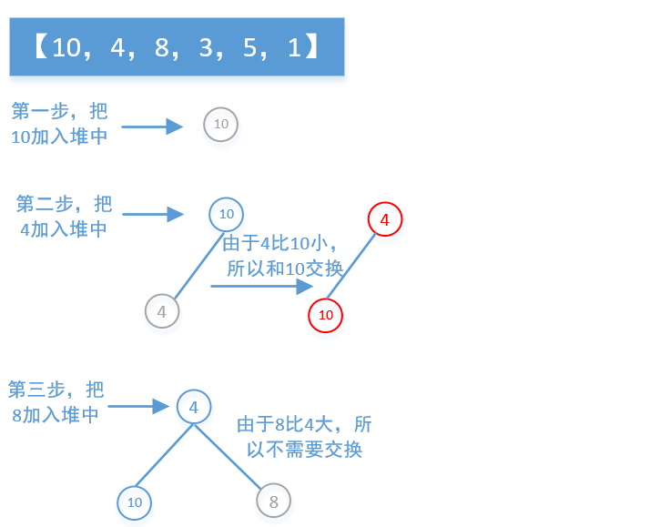

-
结点中的数字是数组元素的下标，不是数组元素的值。所以如果我们知道父节点的下标我们就可以知道他的两个子节点（如果有子节点），如果知道子节点的下标也一定能找到父节点的下标，他们的关系是：

父节点的下标=（子节点下标-1）>>1；

左子节点下标=父节点下标*2+1；

右子节点下标=父节点下标*2+2；

### 堆的创建

最大堆的插入操作可以简单看成是“结点上浮”。当我们在向最大堆中插入一个结点我们必须满足完全二叉树的标准，那么被插入结点的位置的是固定的。而且要满足父结点关键字值不小于子结点关键字值，那么我们就需要去移动父结点和子结点的相互位置关系。具体的位置变化，可以看看下面我画的一个简单的图。

### 堆的删除
最大堆的删除操作，总是从堆的根结点删除元素。同样根元素被删除之后为了能够保证该树还是一个完全二叉树，我们需要来移动完全二叉树的最后一个结点，让其继续符合完全二叉树的定义，从这里可以看作是最大堆最后一个结点的下沉（也就是下文提到的结点1）操作。例如在下面的最大堆中执行删除操作：

.png)

### 题目 

1.最后一块石头的重量
https://leetcode.cn/problems/last-stone-weight/