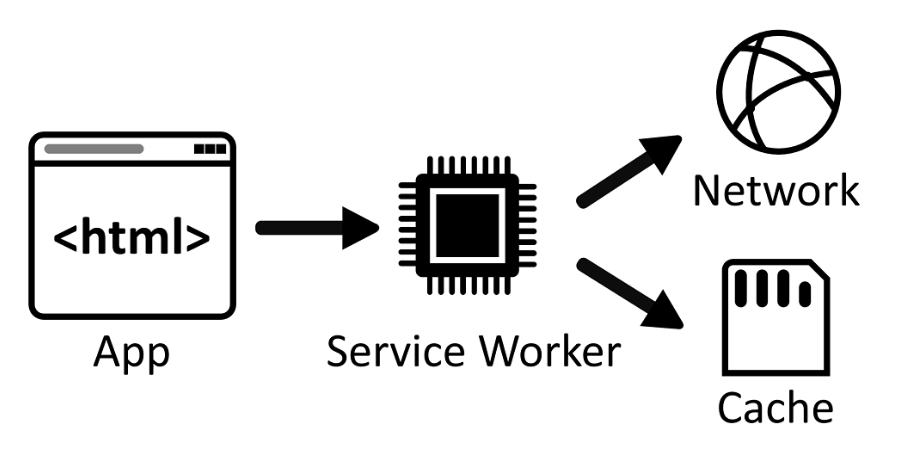

# web worker

Web Workers 在独立的线程中工作，因此，需要单独的执行代码文件。
workers 和主线程间的数据传递通过这样的消息机制进行 —— 双方都使用 postMessage() 方法发送各自的消息，使用 onmessage 事件处理函数来响应消息（消息被包含在message事件的 data 属性中）。这个过程中数据并不是被共享而是被复制。

适用于大量复杂计算场景： excel大文件导出、图片压缩

限制：
- 同源
- 文件限制，不能使用file://，需来自于网络
- dom操作限制无法使用document, window
- 通信限制，主线程和worker限制只能通过postmessage通信
- 不能使用alert,但可以使用xhr发出请求请求，也可以使用settimeout/setinterval等API


# serviceworker



Service Worker 是一个 JavaScript 文件，它运行在浏览器后台，独立于网页进程。因此，它可以在网页关闭或者用户离开网页的情况下继续运行。Service Worker 可以拦截和处理网页发出的请求，可以通过编写代码来自定义处理这些请求。
Service Worker 的生命周期包括三个阶段：安装、激活和运行。在安装阶段，Service Worker 会被下载到本地并缓存。在激活阶段，它会取代之前的 Service Worker，并更新网站的缓存。在运行阶段，Service Worker 会拦截和处理网页发出的请求，可以从缓存中读取数据或者将请求转发到服务器获取数据。


## Service Worker 的使用方法

独立于网页，可以在后台运行，即使用户关闭了网页也可以继续运行；
可以拦截和处理网络请求，包括请求的URL、请求头和请求体等信息；
可以缓存任何类型的数据，包括HTML、CSS、JavaScript、图片、音频、视频等等；
可以在离线时缓存页面和数据，提高应用的性能和用户体验；
可以通过消息传递机制与网页进行通信。

```javascript

// 判断http，浏览器是否支持此api 
if ('serviceWorker' in navigator) {
  // 支持 Service Worker
}

```

接下来，需要编写 Service Worker 的代码。通常，Service Worker 的代码是单独的 JavaScript 文件，与网页分离。可以通过以下代码在网页中注册 Service Worker：

```javascript
navigator.serviceWorker.register('./service-worker.js')
  .then(registration => {
    // 注册成功
  })
  .catch(error => {
    // 注册失败
  });

```
### 1. 拦截网络请求


### 2. 静态资源


```javascript

const cacheName = 'my-cache';
const filesToCache = [
  '/',
  '/styles/main.css',
  '/scripts/main.js',
  '/images/logo.png',
];

// 在安装阶段缓存资源
self.addEventListener('install', (event) => {
  event.waitUntil(
    caches.open(cacheName).then((cache) => {
      return cache.addAll(filesToCache);
    })
  );
});

// 在 fetch 事件中返回缓存的资源
self.addEventListener('fetch', (event) => {
  event.respondWith(
    caches.match(event.request).then((response) => {
      return response || fetch(event.request);
    })
  );
});


```


# shareworker