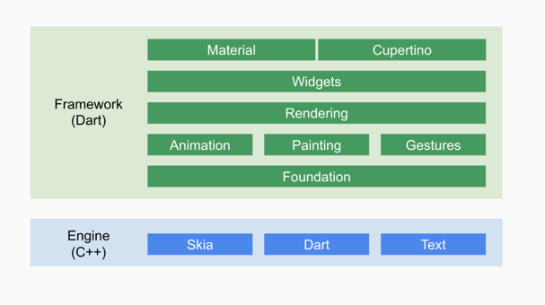
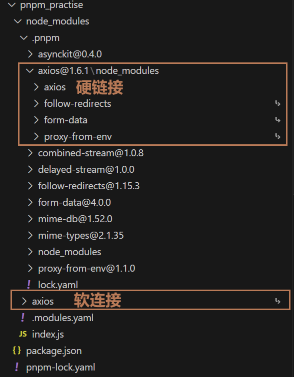

## 自我介绍

面试官你好 ， 我叫何嘉强， 19年毕业于深圳大学，毕业之后从事的是前端开发工程师，有着丰富的技术栈，经验，快速应对完成各种需求，以及优化工作。
目前在公司做的项目是一个可观测系统，包含监控，告警，日志模块，是前端这块的负责人。期间主导过项目webpack的升级，架构改造，权限系统的设计以及各种公共组件的开发。 之前也有过react-native做app开发， 使用fluter的app重构等移动端跨平台的开发经验。 因为自己也对容器化技术比较感兴趣，所以对docker, k8s等容器技术也有一定的了解，能够独立的完成前端项目的开发部署流水线集成。自己平时也比较喜欢写一些文章，对技术进行整理归纳，会发在博客和github上, 让自己有个更好的理解。目前公司技术栈比较老旧，做的内容也比较简单，所以来看看有没新的机会。


## Vue2（3）/ React 原理及细节

- 虚拟dom

本质：其实就是一个js对象，存储着dom的信息。

#### 为什么要有虚拟dom？：

1. 直接操作真实dom会引起**重绘与回流**
2. 对比diff然后去更新dom更加节省性能
3. react/vue 框架的诞生，让前端更加专注于业务逻辑，不必关心dom
4. 跨平台的能力？

### 虚拟dom怎么生成的？如何变成真实dom的？

在React和Vue中都是调用createElement 生成虚拟dom


#### 虚拟dom如何生成真实dom

```javascript

const vDom = {
  type: "div",
  props: {
    id: "0",
    children: [
      {
        type: "span",
        children: 111,
      },
    ],
  },
};

// 其实一共就三步，创建dom，加工属性，以及递归处理子元素，直接上代码：

const render = (element, container) => {
    const el = document.createElement(element.type)
    const props = Object.keys(el.props)
    props.forEach(item=>{
        if(item!=='children')el[item] = element.props[item]
    })
    props.children.forEach(item=>{
        render(item, el)
    })
    container.appendChild(el)
}


```

###  diff算法


### 响应式原理

#### Vue

使用Object.defineProerty或者Proxy实现，get收集depends函数防止队列里, set触发函数, 依赖收集，派发更新。

三个核心的实现

- observer

用Object.defineProerty定义，对于数组进行特殊处理。会对每个数据进行创建一个Dep实例， dep进行 dep.depend() ，也即 Dep.target.addDep(this) ，让watcher记住dep 

- Dep

每一个Dep都有一个静态属性target, Watcher, 这是一个全局唯一 Watcher，这是一个非常巧妙的设计，因为在同一时间只能有一个全局的 Watcher 被计算，另外它的自身属性 subs 也是 Watcher 的数组。

- Watcher

可以简单的认为是一个render函数的封装，Wactch类实现了许多更新的一些额外逻辑，优化等。


#### React

通过 re-render 去发现和更新自身。react 要求我们使用 setState 和 hook 中 的 useState 的 setXXX（value） 去更新数据，进而触发更新。

React 的更新流程大概如下：

setState -> re-render（beginWork 递 & completeWork 归 ）-> commit -> before mutation -> mutation -> layout

React16 架构可以分为三层：

- Scheduler（调度器）—— 调度任务的优先级，高优任务优先进入Reconciler
- Reconciler（协调器）—— 负责找出变化的组件
- Renderer（渲染器）—— 负责将变化的组件渲染到页面上

### Scheduler（调度器）

既然我们以浏览器是否有剩余时间作为任务中断的标准，那么我们需要一种机制，当浏览器有剩余时间时通知我们。

其实部分浏览器已经实现了这个 API，这就是requestIdleCallback。但是由于以下因素，React放弃使用：

浏览器兼容性
触发频率不稳定，受很多因素影响。比如当我们的浏览器切换 tab 后，之前 tab 注册的requestIdleCallback触发的频率会变得很低


### Reconciler（协调器）

我们知道，在 React15 中Reconciler是递归处理虚拟 DOM 的。让我们看看React16 的 Reconciler。

我们可以看见，更新工作从递归变成了可以中断的循环过程。每次循环都会调用shouldYield判断当前是否有剩余时间。

```javascript

/** @noinline */
function workLoopConcurrent() {
  // Perform work until Scheduler asks us to yield
  while (workInProgress !== null && !shouldYield()) {
    workInProgress = performUnitOfWork(workInProgress);
  }
}

```

那么 React16 是如何解决中断更新时 DOM 渲染不完全的问题呢？

在 React16 中，Reconciler与Renderer不再是交替工作。当Scheduler将任务交给Reconciler后，Reconciler会为变化的虚拟 DOM 打上代表增/删/更新的标记，类似这样：

```javascript
export const Placement = /*             */ 0b0000000000010;
export const Update = /*                */ 0b0000000000100;
export const PlacementAndUpdate = /*    */ 0b0000000000110;
export const Deletion = /*              */ 0b0000000001000;
```

整个Scheduler与Reconciler的工作都在内存中进行。只有当所有组件都完成Reconciler的工作，才会统一交给Renderer。


### Renderer（渲染器）

Renderer根据Reconciler为虚拟 DOM 打的标记，同步执行对应的 DOM 操作。

在 React16 架构中整个更新流程为：


其中红框中的步骤随时可能由于以下原因被中断：

- 有其他更高优任务需要先更新
- 当前帧没有剩余时间

由于红框中的工作都在内存中进行，不会更新页面上的 DOM，所以即使反复中断，用户也不会看见更新不完全的 DOM（即上一节演示的情况）。


## React-Native 及 Flutter 对比 ， 浅入了解

### React Native:

在 RN 中，主要有三个重要的组成模块：平台层（ Android 或者 OC 环境），桥接层（ C++ ）和JS 层。

React Native 和 H5 一样，使用了 JS 作为跨端页面的开发语言，因此它必须要有一个 JS 执行引擎，而在使用 H5 的情况下，Webview 是 JS 的执行引擎，同时 Webview 还是页面的渲染引擎。RN 不一样的地方在于，已经有了自己的渲染层，这个功能交给了 Java 层，因为 RN 的 JS 组件代码最后都会渲染成原生组件。因此 RN 只需要一个 JS 执行引擎来跑 React 代码。 RN 团队选择了 JSCore 作为 JS 的执行引擎，而 JSCore 的对外接口是用 C 和 C++ 编写的。因此平台层的 Java 代码 / OC 代码想要通过 JSCore 拿到 JS 的模块和回调函数，只能通过 C++ 提供的接口获取，再加上 C++ 在 iOS 和安卓系统上也有良好的跨端运行的功能，选它作为桥接层是不错的选择。


### Flutter

从图中可以看出 Flutter主要被分为两层 Framework层和Flutter Engine.





Framework层全部使用Dart编写，有完整UI框架的API，并预写了Android（MaterialDesign）和IOS的（Cupertino）风格的UI,极大方便了开发移动端.

Framework 底层是 Flutter 引擎， 引擎主要负责图形绘制 (Skia)、 文字排版 (libtxt) 和提供 Dart 运行时， 引擎全部使用 C++实现.


## 前端工程化（提升效率） 深入了解

我的理解是，前端工程化就是围绕敏捷开发流程，保证项目在团队协作过程中，能快速达到交付的标准，降低事故，所以答案呼之欲出了。想尽办法，提高持续交付的能力，为项目服务。

### 需求评审

- UI设计稿 制定标准规范，搭建开发组件库
- 搭建物料库
- 给出风险点，方案，排期等。 团队选择

### 准备开发

- 仓库的创建，devops 平台（例如域名地址生成，网关路径匹配）
- 项目初始化，也就是脚手架初始化项目
- 包管理 monorepo ，文件管理、目录管理等规范
- js、css 等规范
- 按照设计文档开发，方便后续维护，也要及时去维护好，方便后续接手， 或者单元测试。

### 开发阶段

- git 分支管理，code review 等
- IDE 提升效率插件， 代码提示
- 编译相关，也就是基于 webpack、vite 等 eslint 等大家熟知的工具链相关
- 本地 mock 服务（接口文档）
- 打包配置
- 单元测试
- 利用ai工具

### 发布交付

- git hook， commitlint 提交等流水相关
- 打包构建，CDN 相关
- jenkins、 docker、k8s 等镜像管理
- 自动化测试
- A、B test

### 上线

- 前端监控
- 埋点

### 复盘阶段

- 这个需求是否带来了价值， 用户是否在使用？满意度如何？是否能有改进的地方？（缺少）
- 开发人员缺陷复盘，下次如何避免（片面）


babel, eslint, preitter, husky, webpack 待补充

## babel

在前端项目里面特别重要，我们编写的代码几乎都要经过babel处理，兼容不同的浏览器。

### 在webpack中一般如何配置babel

一般有babel-loader, babel/core, babel-preset

- babel-loader: 识别匹配文件和接受对应参数的函数
- babel/core:  babel-core是babel最核心的一个编译库，他可以将我们的代码进行词法分析--语法分析--语义分析过程从而生成AST抽象语法树，从而对于“这棵树”的操作之后再通过编译称为新的代码。
- babel-preset: 诉babel我需要以为什么样的规则进行代码转移。

polyfill: 

首先我们来理清楚这三个概念:

- 最新ES语法，比如：箭头函数，let/const。
- 最新ES Api，比如Promise
- 最新ES实例/静态方法，比如String.prototype.include

babel-prest-env仅仅只会转化最新的es语法，并不会转化对应的Api和实例方法,比如说ES 6中的Array.from静态方法。babel是不会转译这个方法的，如果想在低版本浏览器中识别并且运行Array.from方法达到我们的预期就需要额外引入polyfill进行在Array上添加实现这个方法。

其实可以稍微简单总结一下，语法层面的转化preset-env完全可以胜任。但是一些内置方法模块，仅仅通过preset-env的语法转化是无法进行识别转化的，所以就需要一系列类似”垫片“的工具进行补充实现这部分内容的低版本代码实现。这就是所谓的polyfill的作用，

针对于polyfill方法的内容，babel中涉及两个方面来解决：


- @babel/polyfill


- @babel/runtime


- @babel/plugin-transform-runtime

## webpack 打包原理，概念 重点掌握

- loader, plugin区别

load一般用来做源码转换，如babel-loader, vue-loader

plugin 功能强大一点，提供许多生命周期的钩子。 html-webpack-plugin，注入打包文件， DefinePlugin， Dll plugin

- bundle optimization(bundle优化)
- assets management(assets管理)
- injection of environment variables(注入环境变量)
etc.

- 手写一个plugin

写过一个在打包构建产物完成阶段的hook plugin, 用来处理静态资源的路径和dll.contenthash

complier 和 compliation

- Compiler类的实例，webpack 从开始执行到结束，Compiler只会实例化一次。compiler 对象记录了 webpack 运行环境的所有的信息，插件可以通过它获取到 webpack 的配置信息，如entry、output、module等配置。

- Compilation类实例，提供了 webpack 大部分生命周期Hook API供自定义处理时做拓展使用。一个 compilation 对象记录了一次构建到生成资源过程中的信息，它储存了当前的模块资源、编译生成的资源、变化的文件、以及被跟踪依赖的状态信息。

## 你们echart是如何封装的以及是如何滑选的？


首先echart开启滑选功能需要配置tooltip 以及datazoom属性，但是页面上会多出工具栏，以及一个滑动条，这样对ui效果不是很好看。 所以我们采用的是另外的方式，
在initchart的时候dispatch('takeGlobalCursor'), 这样会默认帮我们开启滑选功能，不用手动选择。 然后用滑动滚动条


```javascript
 // emit: 在生成资源并输出到目录之前
compiler.hooks.emit

// 
compilation.hooks.afterProcessAssets

```

- 热更新原理

websocket

- 优化拆包

更多要看 webpack目录笔记


## 鲸眼前端负责人 需要深入其中，做好充分准备

1. 业务方面(如果岗位类似，需要详细回答，若不是，可简单回答)

- 理解业务 对象模型，业务（项目），实例， 权限中心
- 项目问题解决
- TR2 内部需求评估，预审，判断项目需求成本效益比(how)
- TR3 技术方案的意见，编写
- TR4 内部验收阶段 评审

概念：

- 可观测系统 监控，告警，日志，apm


腾讯云可观测平台（Tencent Cloud Observability Platform，TCOP）可收集并通过图表展示腾讯云云产品自助上报的各项监控指标和用户自定义配制上报的监控指标，以及针对指标设置告警。为您提供立体化云产品数据监控、智能化数据分析、实时化异常告警和个性化数据报表配置，让您实时、精准掌控业务和各个云产品健康状况。


通过收集和分析系统的各种数据，内置监控指标，用户自定义监控指标，，及针对指标设置告警，构建一个全方位、立体化的监控与分析体系。使运维团队能够在复杂、动态的 IT 环境中实时了解系统内部的健康状况、性能表现以及故障原因，并基于这些信息做出准确的决策，实现快速问题定位、预防性维护以及持续优化。


1. 技术方面

- 技术方案预研，调研(monorepo, git submodule的方式)
- 流水线的部署打包，公共模块（指令，组件）开发，webpack的配置调优
- 内部优化需求的分配，预研


### 架构升级 ，微前端架构演变-》单体

1. 背景，

老saas 监控,告警需要集成两个新saas，apm, rum 到一起并做了ui风格统一化
但是问题频繁出现。

1. 背景原因
- 开发体验差：
  1. 需要起多个项目
  2. 在框架层面上可能有些需求不太满足，例如路由跳转携带state参数
- 测试体验差：
  1. 5个sass频繁部署,导致测试环境经常奔溃。
  2. 导致测试分不清是部署导致的问题还是代码逻辑问题。
- 代码复用较差：
  1. 许多相似的组件逻辑难比较难服用，需要大量时间整理出来放在主站，子项目引用。
  2. 各个第三方库其实每个项目都差不多，重复打包，利用率较低。 导致体积包增大。
  3. 各个模块其实联系还挺密切，需要频繁进行通信，现有框架比较困难
  
基于种种问题进行了架构的改进。


2. Task:
  
- 预研
前期调研我们的是打算采用monorepo的方式进行但是有以下问题：

1. 新老项目依赖有冲突问题，项目无法启动，排查了很久没有排除出来，前端的依赖就是各种问题出现。

#### pnpm和npm安装依赖的区别？

npm是多层级依赖，造成依赖嵌套和幽灵依赖等问题。

#### pnpm:

它通过软硬链接依赖的方式实现了快速安装、去除幽灵依赖，当下各种类库、组件库的最佳实践方案也基本都是 pnpm + monorepo。由于我所在的团队也使用了 pnpm 作为包管理工具，因此想通过一篇分享将 pnpm 从头至尾了解清楚

在了解 pnpm 具体机制之前，我们先了解一下硬链接和软链接（符号链接）的概念：


硬链接（Hard Link）

概念：硬链接是文件系统中的一个链接，它指向磁盘上的数据。当创建一个硬链接时，实际上是在创建一个和原始文件相同的入口点，但是不占用额外的磁盘空间。这个新的链接和原始文件共享相同的数据块，任何一个文件的修改都会反映在另一个上。
特点：硬链接不能跨文件系统创建，也不能用于链接目录，但如果原始文件被删除，硬链接依然可以访问数据。
使用场景：当你想要在不同位置访问同一个文件内容，而又不想占用额外磁盘空间时，可以使用硬链接。比如，在多个项目中共享相同的库文件，但不需要复制这个文件多份。


软链接（符号链接，Symbolic Link）

概念：软链接是一个特殊类型的文件，它包含了另一个文件的路径。类似于 Windows 系统中的快捷方式。与硬链接不同，软链接可以指向目录，也可以跨文件系统。
特点：软链接指向文件或目录的路径，如果原始文件被删除，软链接就会失效，因为它的指向已经不存在了。
使用场景：软链接适用于需要引用特定位置的文件或目录时，特别是当这些文件或目录可能会移动或变化时。它允许链接到另一个文件系统中的文件或目录。


如果使用 pnpm，依赖包将被放在统一的位置，当安装包时，其包含的所有文件会硬链接到这个位置，不会另外占用磁盘空间，这样不同项目之间就可以共享相同版本的依赖。
比如 a/b/c 三个项目都使用 axios，axios 的所有文件都保存在 pnpm 上，axios 这些文件对应着磁盘的数据，直接 a/b/c 项目的axios 通过硬链接指向磁盘里的数据。 这样有两个好处：
（1）效率非常高，无需下载、查找缓存解压等操作
（2）节省磁盘空间，每个项目不需要再下载一份

#### 非扁平的 node_modules 目录
使用 npm 或者 yarn安装的依赖包会将所有的子级依赖全部平铺到 node_modules 文件夹中，即扁平化的目录结构，这样会导致源码可以访问本来不属于当前项目所设定的依赖包也即幽灵依赖


那 pnpm 是如何做到非扁平化并且不重复安装的呢？答案就是它使用硬链接与软连接结合的方式来与依赖包关联。

在 node_modules 根目录有一个文件夹 .pnpm，这里包含了项目所有依赖。
根目录下 axios 软连接到 .pnpm 目录下的 axios 文件夹中，展开 .pnpm/axios@16.1 的node_modules 文件夹，其中有 axios 所需的依赖，包含 axios、follow-redirects、form-data、proxy-from-env，其中 axios 硬链接到磁盘中（即与 pnpm 仓库保存的地址一致），其它文件软连接到 .pnpm 的自身位置。



#### 幽灵依赖？

在package.json没有指定，却依然可以使用（lodash）

我明明只安装了 express,怎么 node_modules 下会出现那么多包?其实很简单,那是因为 express 依赖了一些包,而依赖的这些包又会依赖其它包...npm 则是把这些包拍平了放到了 node_modules 下,这也就导致 node_modules 里出现了这么多包。
那么问题又来了,那 node_modules 下的这些包我没有去主动安装我能不导入呢?答案是肯定的。比如新建一个 index.js,然后导入 node_modules 下的body-parser
发现是可以使用的,但是我们并没有去安装 body-parser。而这种依赖包就被称为为幽灵依赖


1. alias @ 符号，不认识，相关组件引入报错
2. 不适合业务项目的组织方式，一般是基础组件，npm库等。
1. 新老项目依赖有冲突，导致node_modules难以复用，项无法启动
2. 各种alias @ 符号识别不出，相关组件引入报错


submodule 集成（单体打包运行，但是各自的仓库还是分散）
1. 这样改造成本很小，基本只用改造vuex, 路由，即可。其他还是引用各自项目的文件。
2. 做到了单体项目，但是各自业务还是各自开发。


3. Action

- 开始行动
 改造使用主仓的vuex （namespace 隔离）, router, 并且都做了文件自动导入功能。(状态管理, router)
 文件引入路径（assets）
 样式适配
 接口统一(api)
 流水线改造（自动部署）


1. 结果：

不论是开发和测试，使用体验都好了很多。


### 引出的问题：

- 微前端的原理

常见的css隔离方案有哪些以及原理？
- BEM(算隔离吗？)
- css-in-js (styles component)
- css modules(less, scss等预处理器)
- shadow dom

常见的js隔离方案的原理？
- iframe(天然隔离)
- Proxy加一个创建出来的fakeWindow{}(new Function、with)

子应用之间如何通信?
- 发布订阅，观察者模式

pnpm和npm的原理


### 权限系统的设计

代码整合了之后，现在就是统一权限系统的设计。
包括路由，按钮的权限

我们公司的权限（Resource-Based Access Control，RBAC）基于资源的访问控制，主要是分为：

#### 功能权限

功能权限, 指的是对页面功能访问的权限，初始化的时候需要调用接口获取所有的功能权限点。存放在vuex的state里面并且采用getters来判断用户是否拥有某个权限。

在定义前端路由的时候：

配置页面路由meta字段,页面功能对应的权限permission, license code(列表页，说明页等)。

全局守卫

路由配置中设置每个页面的 meta 字段：
permission：页面所需的功能权限标识。
licenseCode：页面的许可代码。

Vue Router 提供了 beforeEach 全局前置守卫，我们可以利用它在每次路由切换时对权限进行检查。如果用户没有所需权限，我们可以将其重定向到未授权页面或者显示相应的提示信息。

#### 数据权限：（某些列表数据的编辑页，详情页）

数据权限就无法在初始化的时候就获得，但也不可能在每一个详情页面就写一遍请求，发起接口去判断有无权限，我们尽量还是在入口出处理，所以我们在路由钩子处判断路径url有无query参数id，并且有无配置路由permission,有的话就发起权限接口请求。


按钮：

封装一个auth-button ，功能包含无相关权限, license code置灰，并有tools-tips提示。


## webpack 4-5 升级，具体事项

1. 背景，原因

   1. 打包流水线构建速度很慢，经常一次要半个小时。影响交付效率
   2. 看到了rspack的文章，由此而来。

2. TASK
   主要是依赖升级适配， 难道是eslint, babel， node-saas的一个兼容等

3. action 行动

4. result
流水线构建效率提示了100%， 体积减少20mb


### 引入的问题

- webpack4 和 webpack5的区别？
- webpack流程？


## 内部基础工具建设

1. UI库
负责公司内部组件库日小功能添加， 缺陷修复。


- 如何调试？
在本地如何复现

- 1. 把项目拉下来，修改项目库的package.json的入口文件， 增加debugger，或者console信息


2. 主题定制功能。


3. 样例库

这个项目是内部第三方插件库的一些使用案例，可以在上面做简单的代码编辑功能。


技术栈是nodejs koa + mysql typeporm，我主要是做了vue在线编辑器的功能。

主要是集成了moncoeditor + vue-template-compiler 库来达到编辑
后端这块是使用typeorm 完成crud


4. Cli脚手架 开发框架

node 技术， 拉起仓库， 修改文件名称等
新增了webpack5开发模板， 并且支持ts


### ui/ux 规范沉淀


## 项目最难的点？ （最难的组件or逻辑）

### 1. 流程图

需求： 做一个etl流程， 抽取，清洗，结果。

负责整个设计，达到搞拓展性

难点1： 

判断环。 因为流程图是一个有向图无环图，图里面判断有无环的办法可以用拓扑排序，并且用邻接表的方式存储。

难点2：

交互量大，细节多，


技术边界

问题分为
1. 可以google到的问题
   - 1. 某些报错， 异常
   - 2. 通用函数的逻辑编写
  
2. google不到的问题
    - 1. 业务问题
    - 2. 分析， 解决方案综合对比。


### 1. 告警队列问题


需求： 告警产生时，需要播报语音和弹出消息message, 并且防止告警风暴导致内容堆积，我们只需要保留播报最新的5条。语音播报完成后弹框消失，自动播放下一条。也可以主动关掉弹框并且语音播报也同时消失，自动播放下一条。

逻辑其实不是很难，但因为这里会涉及到一些浏览器的api，所以需要看支不支持。不支持的话需要怎样设计代码去达到一样的效果。

在充分了解需求后，我理解的难点主要有三个，

- 难点1. **维护队列**

达到有序播放，先到先播的效果， 所以这里符合队列的数据结构。
  
搞清楚消费者，生产者的逻辑

- 待弹窗队列：


对于队列来说一般都存在消费者，和生产者。 
生产者也就是我们定时去请求接口产生的数据，把他放在我们的队列里。需要判断队列长度是否大于5。如果大于5需要把前面数据丢掉。
  
消费者，一般来说就是我们播报语音完成后，或者手动关闭弹窗提示，需要判断队列长度是否为空，如果不为空，则从队列消费一条。

- 已经弹窗，但还没播放，待播放语音队列：


- 难点2. **语音的播放**

播放功能调用了浏览器的api实现，出了设计方案（主要思路， api， 兼容性， 伪代码）由后端，产品评审。 没有采用tts sdk等。部署成本过高。

**为什么需要已经弹窗，但还没播放队列呢？**

一般的话就是说弹一个窗就播一个语音，一个语音播完之后下一条，但这里主要有两个问题， **一**是由于我们的播报类型是分为audio音频, 文字转语音speech的，会同时播放，造成混乱。**二**是无法做到需求中的手动关闭弹窗，语音也要关掉，因为浏览器的api，cancel调语音后会取消所有语音。 所以我们需要同时创建一个已经弹窗，但还没播放，待播放语音队列。（第三点） **三** 如果打开页面什么都不做的话， 音视频无法自动播放。 （b站，斗鱼可以是因为浏览器有个白名单策略）


难点3. **语音和消息弹窗功能关联**

是如何把弹框和语音如何联系起来，即语音完成后，弹框需要消失，弹框消失语音也要消。                                                                                                                                                                                                                                                                             
弹框消失

1. 手动关闭当前播放的，还是没播放的，未播放的我们不需要取消语音。

因为有个待播放的语音队列，，通过查早如果在队列里面说明是，说明是待播放，此时需要从队列里删除
如果不在队列，说明是正在播放，需要暂停语音。

语音播放完

2. 所幸的是所有的语音都有提供结束事件的回调，所以我们在播放语音的时候，从待播放队列取取出语音播放的时候，设置结束函数，因为有存储message的引用，可以调用close。

**解决办法**是同时创建一个待播放语音的队列，该数组对象同时存储该语音的引用和message的引用，


### 2. ui暗黑主题适配

  难点1： 如何设计？

  首先我们使用的是引入配置主题文件json的设计，不是像其他arco或者ant-design一样，在某个地方定义变量，或者引入一个webpack-plugin。（因为我们组件没有用预处理器sass,less）

  （arco的主题定制）核心原理是：

  `主题引入`：指定主题包名，插件会读取主题包的变量内容注入到 less-loader 的 modifyVars。
  会分dark, ligth两个变量去区分，所以arco或者antd一个库


  所以我们只能通过引入主题定制的json文件去实现，
  把css变量插入到body上。

  基础色（配置） -》 组件色 （配置） -》 生成json文件 -》 引入配置json文件，插入dom 标签属性 


  难点2： 暗色/亮色适配

  颜色如何定义？
  色盘Blue, orange, red(基础色)
  我们用的是danger，（--）, info, warn
  然后基础色使用的是rgb**数值**，这样在功能色上可以更方便的使用透明度
  功能色使用的是16进制或者rgb

  暗色需要透明度，按照亮色的设计但是没有的，直接写的16进制，例如primary: #1272ff, 为了使改动最小化，节省工作量，所以需要加多一个中间变量。 比如说brand: 25,25,133。 这样暗色是primary: rgba(var(--brand-6)) 。 


### 3. webpack升级


### 4. 需求开发时间紧， 任务重（挑战性强）

1. 提前mock好所有的接口（yapi）， 然后补齐边界情况交互（figma），并且执行自测

### 5. react datasource插件

1. 调试困难， 查看英文doc， 解决了代理问题
****
2. TS + class 写法 （class写法不太熟悉， 按照之前function写法）


### echart大数据优化


### 开发了一个plugin 提高工作效率（可以往plugin, loader扯或者ast抽象语法树）

inject-dllVendors plugin

由于我们把dll变成不是每次build都构建运行，所以如果dll发生改变的化，如何把改变的plugin script标签放到index.prod.html？ 手动方式很不方便，所以开发了一个plugin,每次build dll的时候
去自动改变。 

大概原理就是在build dll的webpack构建配置中，加入写的plugin。 其中插件监听compiler 完成构建asstes的时候，获得名称，然后把他给加到index.html上。

## 离职原因

1. 职业发展与自己规划的不符

寻求在技术深度或者技术广度上有一定的发展，但业务主导，技术氛围不浓厚(前端leader离职)

2. 技术栈老旧

3. 薪资涨幅调整空间不大
