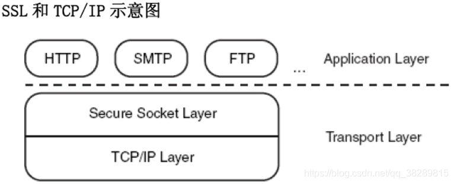
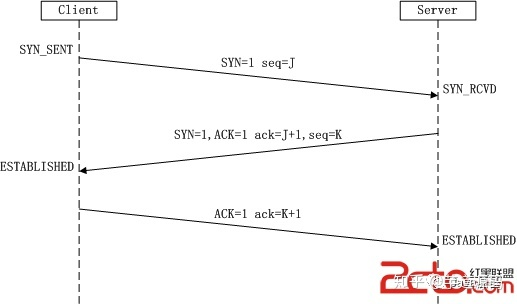
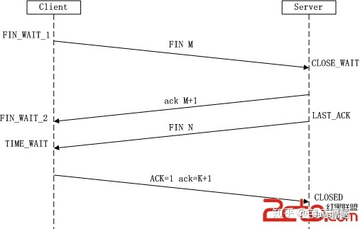

1. typeof 与 instanceof 的区别?

typeof一元运算符，用来返回操作数类型的字符串。
typeof几乎不可能得到它们想要的结果。typeof只有一个实际应用场景，就是用来检测一个对象是否已经定义或者是否已经赋值。而这个应用却不是来检查对象的类型。
除非为了检测一个变量是否已经定义，我们应尽量避免使用 typeof 操作符。

instanceof 左操作数是一个类，右操作数是标识对象的类。如果左侧的对象是右侧类的实例，则返回true.而js中对象的类是通过初始化它们的构造函数来定义的。即instanceof的右操作数应当是一个函数。所有的对象都是object的实例。如果左操作数不是对象，则返回false,如果右操作数不是函数，则抛出typeError。
instanceof 运算符是用来测试一个对象是否在其原型链原型构造函数的属性。其语法是object instanceof constructor
instanceof 操作符用来比较两个操作数的构造函数。只有在比较自定义的对象时才有意义。 如果用来比较内置类型，将会和 typeof 操作符 一样用处不大。

JavaScript 标准文档只给出了一种获取 [[Class]] 值的方法，那就是使用 Object.prototype.toString。
function is(type, obj) {
    var clas = Object.prototype.toString.call(obj).slice(8, -1);
    return obj !== undefined && obj !== null && clas === type;
}

is('String', 'test'); // true
is('String', new String('test')); // true


2.原型链
我们先来了解下面引用类型的四个规则：
1、引用类型，都具有对象特性，即可自由扩展属性。
2、引用类型，都有一个隐式原型 __proto__ 属性，属性值是一个普通的对象。
3、引用类型，隐式原型 __proto__ 的属性值指向它的构造函数的显式原型 prototype 属性值。
4、当你试图得到一个对象的某个属性时，如果这个对象本身没有这个属性，那么它会去它的隐式原型 __proto__（也就是它的构造函数的显式原型 prototype）中寻找。

引用类型有Function,Object,Array,Date,RegExp。
什么是显式原型,隐式原型?  显式原型prototype,隐式原型__proto__

四个概念,2个准则
1.js分为函数对象和普通对象，每个对象都有__proto__属性，但是只有函数对象才有prototype属性
2.Object、Function都是js内置的函数, 类似的还有我们常用到的Array、RegExp、Date、Boolean、Number、String
3.属性__proto__是一个对象，它有两个属性，constructor和__proto__；
4.原型对象prototype有一个默认的constructor属性，用于记录实例是由哪个构造函数创建；

1. Person.prototype.constructor == Person // **准则1：原型对象（即Person.prototype）的constructor指向构造函数本身**
2. person01.__proto__ == Person.prototype // **准则2：实例（即person01）的__proto__和原型对象指向同一个地方**

注意点
__proto__ 是非标准属性，如果要访问一个对象的原型，建议使用 ES6 新增的 Reflect.getPrototypeOf 或者 Object.getPrototypeOf() 方法，而不是直接 obj.__proto__，因为非标准属性意味着未来可能直接会修改或者移除该属性。同理，当改变一个对象的原型时，最好也使用 ES6 提供的 Reflect.setPrototypeOf 或 Object.setPrototypeOf。


3.继承

3.1原型继承
原型链继承，就是让对象实例通过原型链的方式串联起来，当访问目标对象的某一属性时，能顺着原型链进行查找，从而达到类似继承的效果。
SubType.protype = New SuperType()
SubType.prototype.constructor = SubType;
述是原型继承的一种最初始的状态，我们分析上面代码，会发现还是会有问题：

在创建子类实例的时候，不能向超类型的构造函数中传递参数。
这样创建的子类原型会包含父类的实例属性，造成引用类型属性同步修改的问题。


3.2组合继承

组合继承使用 call 在子类构造函数中调用父类构造函数，解决了上述两个问题：
然而它还是存在问题：父类的构造函数被调用了两次（创建子类原型时调用了一次，创建子类实例时又调用了一次），导致子类原型上会存在父类实例属性，浪费内存。
// 组合继承实现

function Parent(value) {
    this.value = value;
}

Parent.prototype.getValue = function() {
    console.log(this.value);
}

function Child(value) {
    Parent.call(this, value)
}

Child.prototype = new Parent();

const child = new Child(1)
child.getValue();
child instanceof Parent;

3.3寄生组合继承
核心实现是：用一个 F 空的构造函数去取代执行了 Parent 这个构造函数。
function Parent(val){
    this.val = val
}

Parent.prototype.getVal = function(){
    return this.val
}

function Child(val){
    Parent.call(this,val)
}

function create(proto){
    function F(){}
    F.prototype = proto
    return new F()
}
Child.prototype = create(Parent.prototype)
Child.prototype.constructor = Child;


### 4.http 和 https
版本问题
- 0.9(单行协议HTTP于1990年问世，那时候HTTP非常简单：只支持GET方法；没有首部；只能获取纯文本)->
- 1.0->(1996年，HTTP正式被作为标准公布，版本为HTTP/1.0。1.0版本增加了首部、状态码、权限、缓存、长连接（默认短连接）等规范，可以说搭建了协议的基本框架。)
- 1.1->(进一步完善1997年，1.1版本接踵而至。1.1版本的重大改进在于默认长连接；强制客户端提供Host首部；管线化；Cache-Control、ETag等缓存的相关扩展。)
- 2.0

Http (HTTP-Hypertext transfer protocol) 超文本协议, 是一个简单的请求-响应协议，它通常运行在TCP之上。它指定了客户端可能发送给服务器什么样的消息以及得到什么样的响应。请求和响应消息的头以ASCII码形式给出；而消息内容则具有一个类似MIME的格式。



Https（全称：Hyper Text Transfer Protocol over SecureSocket Layer），是以安全为目标的 HTTP 通道，在HTTP的基础上通过传输加密和身份认证保证了传输过程的安全性 。HTTPS 在HTTP 的基础下加入SSL 层，HTTPS 的安全基础是 SSL，因此加密的详细内容就需要 SSL。 HTTPS 存在不同于 HTTP 的默认端口及一个加密/身份验证层（在 HTTP与 TCP 之间）。这个系统提供了身份验证与加密通讯方法。它被广泛用于万维网上安全敏感的通讯，例如交易支付等方面 。

#### HTTP 与 HTTPS 的区别
- HTTPS 协议需要到 CA （Certificate Authority，证书颁发机构）申请证书，一般免费证书较少，因而需要一定费用。
- HTTP 是超文本传输协议，信息是明文传输，HTTPS 则是具有安全性的 SSL 加密传输协议。
- HTTP 和 HTTPS 使用的是完全不同的连接方式，用的端口也不一样，前者是80，后者是443。
- HTTP 的连接很简单，是无状态的。HTTPS 协议是由 SSL+HTTP 协议构建的可进行加密传输、身份认证的网络协议，比 HTTP 协议安全。(无状态的意思是其数据包的发送、传输和接收都是相互独立的。无连接的意思是指通信双方都不长久的维持对方的任何信息。)

### http的三次握手和四次挥手

#### 什么是“3次握手，4次挥手”
TCP是一种面向连接的单播协议，在发送数据前，通信双方必须在彼此间建立一条连接。所谓的“连接”，其实是客户端和服务器的内存里保存的一份关于对方的信息，如ip地址、端口号等。

TCP可以看成是一种字节流，它会处理IP层或以下的层的丢包、重复以及错误问题。在连接的建立过程中，双方需要交换一些连接的参数。这些参数可以放在TCP头部。

TCP提供了一种可靠、面向连接、字节流、传输层的服务，采用三次握手建立一个连接。采用4次挥手来关闭一个连接。

客户端和服务端通信前要进行连接，“3次握手”的作用就是双方都能明确自己和对方的收、发能力是正常的

**第一次握手：**客户端A将标志位SYN置为1,随机产生一个值为seq=J（J的取值范围为=1234567）的数据包到服务器，客户端A进入SYN_SENT状态，等待服务端B确认；

**第二次握手：**服务端B收到数据包后由标志位SYN=1知道客户端A请求建立连接，服务端B将标志位SYN和ACK都置为1，ack=J+1，随机产生一个值seq=K，并将该数据包发送给客户端A以确认连接请求，服务端B进入SYN_RCVD状态。

**第三次握手：**客户端A收到确认后，检查ack是否为J+1，ACK是否为1，如果正确则将标志位ACK置为1，ack=K+1，并将该数据包发送给服务端B，服务端B检查ack是否为K+1，ACK是否为1，如果正确则连接建立成功，客户端A和服务端B进入ESTABLISHED状态，完成三次握手，随后客户端A与服务端B之间可以开始传输数据了。




第一次挥手： Client发送一个FIN，用来关闭Client到Server的数据传送，Client进入FIN_WAIT_1状态。

第二次挥手： Server收到FIN后，发送一个ACK给Client，确认序号为收到序号+1（与- SYN相同，一个FIN占用一个序号），Server进入CLOSE_WAIT状态。

第三次挥手： Server发送一个FIN，用来关闭Server到Client的数据传送，Server进入LAST_ACK状态。

第四次挥手： Client收到FIN后，Client进入TIME_WAIT状态，接着发送一个ACK给Server，确认序号为收到序号+1，Server进入CLOSED状态，完成四次挥手。



### 从输入 URL 到页面展示到底发生了什么？
- 2、浏览器查找域名的 IP 地址(DNS，递归和迭代查询)
- 3、浏览器向 web 服务器发送一个 HTTP 请求 (TCP连接，三次握手，四次挥手)
- 4、服务器的永久重定向响应（301和302状态码，重定向）
- 5、服务器处理请求
- 6、服务器返回一个 HTTP 响应
- 7、浏览器显示 HTML
- 8、浏览器发送请求获取嵌入在 HTML 中的资源（如图片、音频、视频、CSS、JS等等）


### 浏览器渲染html

在浏览器没有完整接受全部HTML文档时，它就已经开始显示这个页面了，浏览器是如何把页面呈现在屏幕上的呢？不同浏览器可能解析的过程不太一样，这里我们只介绍webkit的渲染过程，下图对应的就是WebKit渲染的过程，这个过程包括：

解析html以构建dom树 -> 构建render树 -> 布局render树 -> 绘制render树
浏览器在解析html文件时，会”自上而下“加载，并在加载过程中进行解析渲染。在解析过程中，如果遇到请求外部资源时，如图片、外链的CSS、iconfont等，请求过程是异步的，并不会影响html文档进行加载。

解析过程中，浏览器首先会解析HTML文件构建DOM树，然后解析CSS文件构建渲染树，等到渲染树构建完成后，浏览器开始布局渲染树并将其绘制到屏幕上。这个过程比较复杂，涉及到两个概念: reflow(回流)和repain(重绘)。

DOM节点中的各个元素都是以盒模型的形式存在，这些都需要浏览器去计算其位置和大小等，这个过程称为relow;当盒模型的位置,大小以及其他属性，如颜色,字体,等确定下来之后，浏览器便开始绘制内容，这个过程称为repain。

页面在首次加载时必然会经历reflow和repain。reflow和repain过程是非常消耗性能的，尤其是在移动设备上，它会破坏用户体验，有时会造成页面卡顿。所以我们应该尽可能少的减少reflow和repain。

当文档加载过程中遇到js文件，html文档会挂起渲染（加载解析渲染同步）的线程，不仅要等待文档中js文件加载完毕，还要等待解析执行完毕，才可以恢复html文档的渲染线程。因为JS有可能会修改DOM，最为经典的document.write，这意味着，在JS执行完成前，后续所有资源的下载可能是没有必要的，这是js阻塞后续资源下载的根本原因。所以我明平时的代码中，js是放在html文档末尾的。

JS的解析是由浏览器中的JS解析引擎完成的，比如谷歌的是V8。JS是单线程运行，也就是说，在同一个时间内只能做一件事，所有的任务都需要排队，前一个任务结束，后一个任务才能开始。但是又存在某些任务比较耗时，如IO读写等，所以需要一种机制可以先执行排在后面的任务，这就是：同步任务(synchronous)和异步任务(asynchronous)。

JS的执行机制就可以看做是一个主线程加上一个任务队列(task queue)。同步任务就是放在主线程上执行的任务，异步任务是放在任务队列中的任务。所有的同步任务在主线程上执行，形成一个执行栈;异步任务有了运行结果就会在任务队列中放置一个事件；脚本运行时先依次运行执行栈，然后会从任务队列里提取事件，运行任务队列中的任务，这个过程是不断重复的，所以又叫做事件循环(Event loop)。


### var, let和const的区别
共同点： 定义声明变量

不同点:
- var 声明的变量可以重复声明,没有块的概念,可以跨块访问,不能跨函数访问,当出现相同的变量名时,后者会覆盖前者,let,const有块级作用域,并且不可重复声明(不存在变量提升，所以用 let 定义的变量一定要在声明后再使用，否则会报错)
- let 定义的变量,只能在块作用域中访问(也就是在花括号内访问),不能跨函数访问
- const 用来定义常量,使用时得先初始化,然后在赋值,只能在块作用域里访问,而且不能修改
- let 和 var 的不同是，在变量声明之前就访问变量的话，会直接提示 ReferenceError，而不像 var 那样使用默认值 undefined


什么是暂时性死区？

官方解释：运行流程进入作用域创建变量，到变量可以被访问之间的这段时间，称为暂时死区。

通俗理解：在let/const声明之前使用会报错


### 虚拟列表功能实现
加载10w条数据方案
- 分页加载。实现简单直接，但是在请求下一页时，可能也会打断用户心流，体验不是最佳。
- 懒加载。实现难度不大，可以解决首屏的压力，但是长时间加载数据，也同样会产生大量元素节点，从而影响应用性能（因为也没有处理过期节点的销毁问题）。
- 虚拟列表。实现难度较大，通过计算滚动视窗，每次只渲染部分元素，既减少了首屏压力，长时间加载也不会有更多的性能负担，可以满足上述大部分场景。

### 深浅拷贝

浅拷贝: 如果原地址发生改变，那么浅拷贝出来的对象也会相应的改变

如果属性是基本类型，拷贝的就是基本类型的值，如果是引用类型，拷贝的就是内存地址。

实现方法：
- Object.assign()

- 扩展运算符

深拷贝：开辟新的内存地址用于存放复制的对象。
实现方法：
- 循环 + 递归

```javascript
function deepclone(obj: Object){
    let newObj = {}
    for(let i in obj){
        if(typeof obj[i] === 'object'){
          newObj[i] = deepclone(obj[i])
        }else{
            newObj[i] = obj[i]
        }
    }
    return obj
}

// 写法2
function deepclone(orig){
    let target = Object.create(Object.getPrototypeof(orig))
    copyOwnProperties(target, orig)
    return target
}

function copyOwnProperties(target,orig){
    Object.getOwnPropertyName(source).forEach(ele=>{
        let desc = Object.getOwnPropertyDescriptor(orig,ele)
        Object.defineProperty(target,ele,desc)
    })
    return target
}
```


### Promise怎么异常捕获
