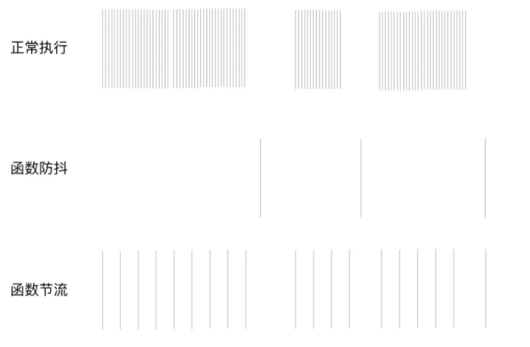

## 1.手写new

```javascript
function A(){}

function New(fn,...arguments){
    let newObj = {} //创建一个空对象
    if (fn.prototype !== null) {
        newObj.__proto__ = fn.prototype;  //对象的原型指向构造函数的原型对象
    }
    let ret = fn.apply(newObj,[...arguments]) // 改变this指向，这样就可以访问到构造函数的属性
    if ((typeof ret === "object" || typeof ret === "function") && ret !== null) {
        return ret;
    }
    return newObj;
}
```

## Object.creat

Object.creat的功能是用参数对象作为新创建对象的原型。

```javascript

function newCreate(obj) {
    function Fn() {}
    Fn.prototype = obj
    return new Fn()
}


```


## instance of

```javascript

function Myinstacneof(objA, objB) {
    let prototypeA = objA.__proto__
    while(prototypeA) {
        if(prototypeA === objB.prototype) return true
        prototypeA = prototypeA.__proto__
    }
    return false
}

```

涉及到原型，原型链知识点。

## 2.call和apply
let foo = {val:1}
function bar(){
    console.log(this.val)
}
我们模拟的步骤可以分为：
将函数设为对象的属性
执行该函数
删除该函数

Function.prototype.call2 =function(context = window,...rests){
    let ctx = context || window
    let func = Symbol()
    ctx[func] = this
    rest = rest ? rest : []
    context.fn(...rest)
    delete context.fn
}

### 3. bind
Function.prototype.myBind = function(context || window,...rest){
    let ctx = context || window
    let fn = Symbol()
    function bind(){
        ctx[fn](...rest)
    }

    return bind
}

4.继承

## 5.防抖节流
本质上是优化高频率执行代码的一种手段
如：浏览器的 resize、scroll、keypress、mousemove 等事件在触发时，会不断地调用绑定在事件上的回调函数，极大地浪费资源，降低前端性能

为了优化体验，需要对这类事件进行调用次数的限制，对此我们就可以采用 防抖（debounce） 和 节流（throttle） 的方式来减少调用频率

定义:

节流: n 秒内只运行一次，若在 n 秒内重复触发，只有一次生效

使用场景：
一个相当普遍的例子，用户在使用一个无限滚动的页面，你需要检测用户的位置到底部之间的距离，如果用户接近屏幕底部，我们应该发送Ajax请求更多内容然后添加到页面上。实现这一功能需要监听页面的scroll事件，然而在手机端缓慢的滚动页面会触发上百次事件，这时候有了throttle就可以对其进行优化，比如每250ms内只调用一次，这样用户基本感觉不到有任何体验上的差别，也优化了程序的性能。


防抖: n 秒后在执行该事件，若在 n 秒内被重复触发，则重新计时

应用场景：

调整resize。
当监听了窗口的resize事件时，并且调整浏览器窗口大小的时候，会触发大量的resize事件，所以呢当你拖拽的时候，调用处理函数做大量计算的时候，会发现拖拽的过程有点卡顿，掉帧。
这时我们可以使用debounce，因为我们关注的是最终值，也就是我们最后停止拖动浏览器窗口的值。

input的输入和发送请求。
在input里输入文字然后发送网络请求，有一种较优的方案就是期望用户输入完毕然后再发送网络请求，而不是输入的过程中不断的发出请求，这能有效的优化网络服务。


相同点：

都可以通过使用 setTimeout 实现
目的都是，降低回调执行频率。节省计算资源
不同点：

函数防抖，在一段连续操作结束后，处理回调，利用clearTimeout和 setTimeout实现。函数节流，在一段连续操作中，每一段时间只执行一次，频率较高的事件中使用来提高性能
函数防抖关注一定时间连续触发的事件，只在最后执行一次，而函数节流一段时间内只执行一次
例如，都设置时间频率为500ms，在2秒时间内，频繁触发函数，节流，每隔 500ms 就执行一次。防抖，则不管调动多少次方法，在2s后，只会执行一次

如下图所示：



```javascript


function throttled(fn,delay){
    let timer
    return function(){
        let _this = this
        let args = arguments
        if(timer)return
        timer = setTimeoit(()=>{
                fn.apply(_this, args)
                timer = null
        },delay)
    }
}

/// 时间戳s
function throttled(fn, delay) {
    let starttime = Date.now()
    return function () {
        let curTime = Date.now() // 当前时间
        let remaining = delay - (curTime - starttime)  // 从上一次到现在，还剩下多少多余时间
        let context = this
        let args = arguments
        if (remaining <= 0) {
            fn.apply(context, args)
            starttime = Date.now()
        }
    }
}


function debounce(func, wait, immediate) {

    let timeout;  //闭包

    return function () {
        let context = this;
        let args = arguments;

        if (timeout) clearTimeout(timeout); // timeout 不为null
        if (immediate) {
            let callNow = !timeout; // 第一次会立即执行，以后只有事件执行后才会再次触发
            timeout = setTimeout(function () {
                timeout = null;
            }, wait)
            if (callNow) {
                func.apply(context, args)
            }
        } else {
            timeout = setTimeout(function () {
                func.apply(context, args)
            }, wait);
        }
    }
}
```


应用场景

防抖在连续的事件，只需触发一次回调的场景有：

搜索框搜索输入。只需用户最后一次输入完，再发送请求

手机号、邮箱验证输入检测

窗口大小resize。只需窗口调整完成后，计算窗口大小。防止重复渲染。

节流在间隔一段时间执行一次回调的场景有：

滚动加载，加载更多或滚到底部监听

搜索框，搜索联想功能


## 深拷贝

```javascript
const  deepClone = (obj)=>{
    const newObj = Array.isArray(obj) ? [] : {}
    for(const k in obj) {
        // in循环会遍历原型链上的，所以需要判断
        if(obj.hasOwnProperty(obj)) {
            if(Object.prototype.toString.call(obj) === 'object []') deepClone(obj[k])
            else newObj[k] = obj[k] 
        }
    }
    return newObj 
}

```

上面的写法还不是最完美的，没有解决循环引用的问题和datetime, Regexp类型的问题。

```javascript

const deepclone = (obj, hash = new Weakmap())=>{
    if(typeof obj !== 'object' || obj==null) return obj
    if(obj instanceof RegExp ) return new RegExp(obj)
    if(obj instanceof Date) return new Date(obj)
    if(hash.get(obj)) return hash.get(obj)
    const newObj = Array.isArray(obj) ? [] : {}
    hash.set(obj, newObj)
    for(const k in obj) {
        // in循环会遍历原型链上的，所以需要判断
        if(obj.hasOwnProperty(obj)) {
            if(Object.prototype.toString.call(obj) === 'object []') deepClone(obj[k], hash)
            else newObj[k] = obj[k] 
        }
    }
    return obj
}


``


## 6.手写-发布订阅模式

```javascript
class EventEmitter{
    constructor(){
        this.eventObj = {}
    }

    on(eventName,cb){
        if(!this.eventObj[eventName]){
            this.eventObj[eventName] = [cb]
        }else{
            this.eventObj[eventName].push(cb)
        }
    }

    // 删除订阅
    off(type, callBack) {
            if (!this.events[type]) return;
            this.events[type] = this.events[type].filter((item) => {
            return item !== callBack;
            });
    }

    emit(eventName,...args){
        this.eventObj[eventName].map(item=>item.apply(this,args))
    }
}

```

## 7.对称二叉树

思路： 同层节点值相等，并且左子树的值要等与右子树。
```javascript
function helper(left?: TreeNode, right?: TreeNode){
    if(!left&&!right)return true;
    if(!left || !right)return false;
    return  left.val===right.val&&helper(left.rightNode,right.leftNode)&&helper(left.leftNode,right.rightNode)
}
```


##  斐波那契数列

指的是这样一个数列 1, 1, 2, 3, 5, 8, 13, 21, 34, 55

简单的递归
``` javascript
const fib = n=>{
    if(n===1 || n===2)return 1
   return fib(n-2) + fib(n-1)
}
```
弊端是耗时，存在太多重复计算

f(6) = f(5) + f(4)
f(5) = f(4) + f(3)
f(4) = (f3) + f(2)

数组保存法
``` javascript
const fib = n=>{
    let fibArr = []
    fib[0] = 1
    fib[1] = 1
    if(n===1 || n===2)return 1
   for(let i =0;i<n;i++){
       fibArr[n] = fibArr[n-2] + fibArr[n-1]
   }
   return fibArr[n-1]
}
```