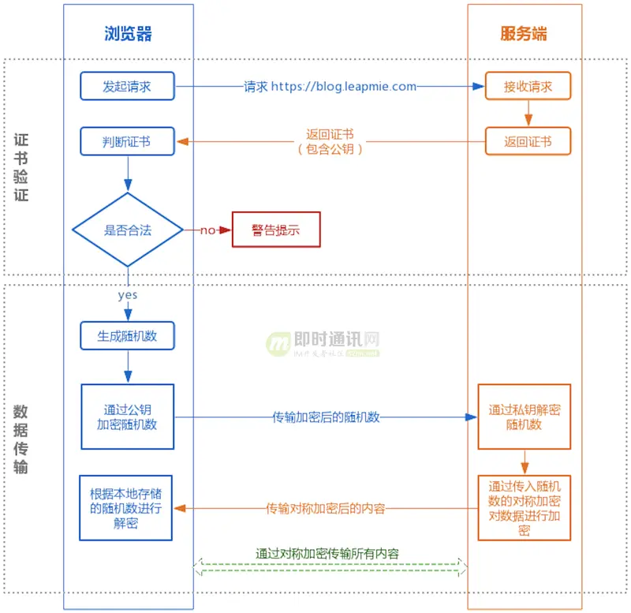

### sql注入
#### 1.1简单注入
1. 数值型注入方式：例如我们后台有这样一个查询sql: 
SELECT * from user_info WHERE id= 
那么我们可以通过修改前端的值位：-1 or 1=1 来实现查询所有的数据，其中-1表示永远不可能存在的数据。
2. 字符串注入的方式：通过注释字符实现绕道
由于# / --通常标识注释，因此可以在输入用户名的时候加上’#，然后输入任意的密码，这样后面查询密码的sql 被注释掉，直接绕过密码校验实现登录；

因此要保证前后台输入框格式的绝对校验。另外严格禁止sql拼接，必须使用占位符

### 2.XSS攻击
跨站脚本攻击，是代码注入的一种，它允许恶意用户将代码注入到网页，其他用户在浏览网页时就会受到影响；将用户输入的数据当作了html语句放到了页面上执行

#### 2.1反射性XSS攻击

非持久化，需要欺骗用户自己去点击链接才能触发XSS代码（服务器中没有这样的页面和内容），一般容易出现在搜索页面。反射型XSS大多数是用来盗取用户的Cookie信息

#### 2.2存储性XSS攻击
1. 假设这是一个交流论坛，其中一个页面中有留言的文本输入框，我们将具有攻击性的脚本写到文本框中，然后提交到服务端。（该脚本的含义表示，获取客户端的cookie，并发送到指定地址）。

2. 后台服务已经将我们提交的数据存储到数据库中。当其他用户在自己计算机中登陆这个网站的时候，服务端会将我们之前写入具有攻击性的XSS脚本留言渲染到HTML页面，从而将该用户页面中的cookie信息发送到我们预留的网站中。
3.接下来，我们就可以用这个人的cookie信息在该网站中“替代”他进行一系列的操作；一个简单的存储型XSS攻击(cookie欺骗)就完成。

针对js获取cookie的解决方案：在cookie中设置了HttpOnly属性为true，那么通过js脚本将无法读取到cookie信息，这样能有效的防止XSS攻击

#### 2.3 XSS攻击的防御措施
1. 转义html:  常用的模板引擎，如 doT.js、ejs、FreeMarker 等，对于 HTML 转义通常只有一个规则，就是把 & < > " ' / 这几个字符转义掉，确实能起到一定的 XSS 防护作用

2. 过滤：在使用 .innerHTML、.outerHTML、document.write() 时要特别小心，不要把不可信的数据作为 HTML 插到页面上，而应尽量使用 .textContent、.setAttribute() 等。如果用 Vue或者React技术栈，并且不使用 v-html/dangerouslySetInnerHTML 功能，就在前端 render 阶段避免 innerHTML、outerHTML 的 XSS 隐患。DOM 中的内联事件监听器，如 location、onclick、onerror、onload、onmouseover 等，\<a> 标签的 href 属性，JavaScript 的 eval()、setTimeout()、setInterval() 等，都能把字符串作为代码运行。如果不可信的数据拼接到字符串中传递给这些 API，很容易产生安全隐患，请务必避免。

### CSRF（Cross-site request forgery）跨站请求伪造

攻击者诱导受害者进入第三方网站，在第三方网站中，向被攻击网站发送跨站请求。利用受害者在被攻击网站已经获取的注册凭证，绕过后台的用户验证，达到冒充用户对被攻击的网站执行某项操作的目的。

这样的前提是这些接口的url和参数都是可以被攻击者猜到或者获取到的，所以才能成功的构造出一个伪造的请求。

防御措施：
- 验证码，需要有交互才能产生，不容易被伪造。 但只是一种辅助手段，不能所有请求都加上。
- 添加token
- refer字段
- cookie的  same-site 

### 中间人攻击

请求被劫持，返回伪造的响应体。

### post为什么会发送两次请求?

先说一下为什么会发两次请求，在非简单请求情况下就会发送两次。
多的一次被称为 **预检请求**。
它的作用是需以获知服务器是否允许该实际请求。预检请求 的使用，可以避免跨域请求对服务器的用户数据产生未预期的影响。

那什么是简单请求呢？有以下条件

- HTTP 方法限制：只能使用 GET、HEAD、POST 这三种 HTTP 方法之一。如果请求使用了其他 HTTP 方法，就不再被视为简单请求。
- 自定义标头限制：请求的 HTTP 标头只能是以下几种常见的标头：Accept、Accept-Language、Content-Language、Last-Event-ID、Content-Type（仅限于 application/x-www-form-urlencoded、multipart/form-data、text/plain）。HTML 头部 header field 字段：DPR、Download、Save-Data、Viewport-Width、WIdth。如果请求使用了其他标头，同样不再被视为简单请求。
- 请求中没有使用 ReadableStream 对象。
- 不使用自定义请求标头：请求不能包含用户自定义的标头。
- 请求中的任意 XMLHttpRequestUpload 对象均没有注册任何事件监听器；XMLHttpRequestUpload 对象可以使用 XMLHttpRequest.upload 属性访问

还有要注意得是预检请求不一定每一次都会产生

这个因为浏览器会对预检请求进行缓存
同时通过服务器端设置 Access-Control-Max-Age 字段来设置缓存时间
那么当第一次请求该 URL 时会发出 OPTIONS 请求，浏览器会根据返回的 Access-Control-Max-Age 字段缓存该请求的 OPTIONS 预检请求的响应结果（具体缓存时间还取决于浏览器的支持的默认最大值，取两者最小值，一般为 10 分钟）。在缓存有效期内，该资源的请求（URL 和 header 字段都相同的情况下）不会再触发预检。（chrome 打开控制台可以看到，当服务器响应 Access-Control-Max-Age 时只有第一次请求会有预检，后面不会了。注意要开启缓存，去掉 disable cache 勾选。）
在 Firefox 中，上限是24小时 （即 86400 秒）。
在 Chromium v76 之前， 上限是 10 分钟（即 600 秒)。
从 Chromium v76 开始，上限是 2 小时（即 7200 秒)。
Chromium 同时规定了一个默认值 5 秒。
如果值为 -1，表示禁用缓存，则每次请求前都需要使用 OPTIONS 预检请求。

### 使用localStorage 或者 sessionStorage 的弊端或者是安全问题？

虽然说前端存储都可以通过浏览器f12或者抓包看得到，但是也要稍微注意一下安全问题。

localStorage/sessionStorage 和 cookie的区别以及特点很多地方都有说到，就不再赘述了。这里我想特别说的是一个安全问题。相对来说cookie会更安全一点，因为cookie可以设httpOnly,这样的话就不能通过document.cookie获取到。会阻止很多恶性脚本插入的风险。如果被注入了恶性脚本，那么第三方就可以通过document.localstorage获取到。

### http的版本以及区别？

目前http的版本有0.9、1.0、1.1、2.0、3.0

http1.0

特点：

- 1、任何格式的内容都可以发送。这使得互联网不仅可以传输文字，还能传输图像、视频、二进制文件。这为互联网的大发展奠定了基础。
- 2、除了GET命令，还引入了POST命令和HEAD命令，丰富了浏览器与服务器的互动手段。
- 3、HTTP请求和回应的格式也变了。除了数据部分，每次通信都必须包括头信息（HTTP header），用来描述一些元数据。
- 4、其他的新增功能还包括状态码（status code）、多字符集支持、多部分发送（multi-part type）、权限（authorization）、缓存（cache）、内容编码（content encoding）等。

不足：

- HTTP/1.0 版的主要缺点是，每个TCP连接只能发送一个请求。发送数据完毕，连接就关闭，如果还要请求其他资源，就必须再新建一个连接。TCP连接的新建成本很高，因为需要客户端和服务器三次握手，并且开始时发送速率较慢（slow start）。所以，HTTP 1.0版本的性能比较差。随着网页加载的外部资源越来越多，这个问题就愈发突出了。

HTTP/1.1

 [特点]

- 1、引入了持久连接（persistent connection），即TCP连接默认不关闭，可以被多个请求复用，不用声明Connection: keep-alive。客户端和服务器发现对方一段时间没有活动，就可以主动关闭连接。不过，规范的做法是，客户端在最后一个请求时，发送Connection: close，明确要求服务器关闭TCP连接
- 2、引入了管道机制（pipelining），即在同一个TCP连接里面，客户端可以同时发送多个请求。这样就进一步改进了HTTP协议的效率。举例来说，客户端需要请求两个资源。以前的做法是，在同一个TCP连接里面，先发送A请求，然后等待服务器做出回应，收到后再发出B请求。管道机制则是允许浏览器同时发出A请求和B请求，但是服务器还是按照顺序，先回应A请求，完成后再回应B请求。
- 3、将Content-length字段的作用进行扩充，即声明本次回应的数据长度（一个TCP连接现在可以传送多个回应，势必就要有一种机制，区分数据包是属于哪一个回应的）
- 4、采用分块传输编码，对于一些很耗时的动态操作，服务器需要等到所有操作完成，才能发送数据，显然这样的效率不高。更好的处理方法是，产生一块数据，就发送一块，采用"流模式"（stream）取代"缓存模式"（buffer）
- 5、1.1版还新增了许多动词方法：PUT、PATCH、HEAD、 OPTIONS、DELETE。另外，客户端请求的头信息新增了Host字段，用来指定服务器的域名

[不足]

虽然1.1版允许复用TCP连接，但是同一个TCP连接里面，所有的数据通信是按次序进行的。服务器只有处理完一个回应，才会进行下一个回应。要是前面的回应特别慢，后面就会有许多请求排队等着。这称为"队头堵塞"（Head-of-line blocking）。为了避免这个问题，只有两种方法：一是减少请求数，二是同时多开持久连接。这导致了很多的网页优化技巧，比如合并脚本和样式表、将图片嵌入CSS代码、域名分片（domain sharding）等等。如果HTTP协议设计得更好一些，这些额外的工作是可以避免的。

### HTTP2.0

简单来说，HTTP/2（超文本传输协议第2版，最初命名为HTTP2.0），是HTTP协议的第二个主要版本。HTTP/2是HTTP协议自1999年HTTP1.1发布后的首个更新，主要基于SPDY协议。
HTTP2.0的特点是：在不改动HTTP语义、方法、状态码、URI及首部字段的情况下，大幅度提高了web性能。

#### 什么是SPDY协议
刚刚对HTTP2.0的介绍中引出了一个名词 —— SPDY协议，这又是什么呢？

SPDY是Speedy的昵音，意为“更快”。它是Google开发的基于TCP协议的应用层协议。目标是优化HTTP协议的性能，通过压缩、多路复用和优先级等技术，缩短网页的加载时间并提高安全性。SPDY协议的核心思想是尽量减少TCP连接数。SPDY并不是一种用于替代HTTP的协议，而是对HTTP协议的增强。

#### HTTP1.x的缺点

任何事物的更新都是为了弥补或修复上个版本的某些问题，那么我们来看看HTTP1.x都有哪些缺点以至于我们要使用HTTP2.0。

HTTP1.x有以下几个主要缺点：

- HTTP/1.0一次只允许在一个TCP连接上发起一个请求，HTTP/1.1使用的流水线技术也只能部分处理请求并发，仍然会存在队列头阻塞问题，因此客户端在需要发起多次请求时，通常会采用建立多连接来减少延迟。
- 单向请求，只能由客户端发起。
- 请求报文与响应报文首部信息冗余量大。
- 数据未压缩，导致数据的传输量大。

#### Http2.0的优点

- 二进制传输
- 多路复用 （可以解决请求过多问题）
- Header压缩
- 服务器Push

### http及https

先抛出问题，带着疑问去阅读文章

- 1）为什么用了 HTTPS 就是安全的？
- 2）HTTPS 的底层原理如何实现？
- 3）用了 HTTPS 就一定安全吗？

#### https的原理

大家可能都听说过 HTTPS 协议之所以是安全的是因为 HTTPS 协议会对传输的数据进行加密，而加密过程是使用了非对称加密实现。但其实：HTTPS 在内容传输的加密上使用的是对称加密，非对称加密只作用在证书验证阶段。具体交互过程如下：

① 证书验证阶段：

1）浏览器发起 HTTPS 请求；
2）服务端返回 HTTPS 证书；
3）客户端验证证书是否合法，如果不合法则提示告警。

② 数据传输阶段：

1）当证书验证合法后，在本地生成随机数；
2）通过公钥加密随机数，并把加密后的随机数传输到服务端；
3）服务端通过私钥对随机数进行解密；
4）服务端通过客户端传入的随机数构造对称加密算法，对返回结果内容进行加密后传输。
